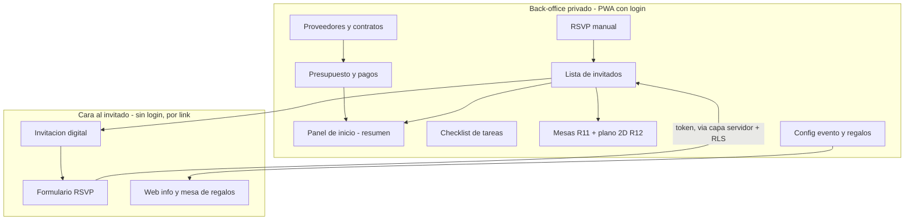

# App de gestión de boda (back-office PWA + invitación digital)

## Problem Frame

Organizar una boda implica coordinar muchos frentes —presupuesto, proveedores, invitados, confirmaciones, mesas, decoración— que suelen acabar repartidos en hojas de cálculo, chats y notas sueltas. El objetivo es **una sola aplicación** para gestionar *todo* lo concerniente a **esta boda concreta** (la del usuario), accesible desde PC y móvil como **PWA instalable**.

La app tiene **dos superficies**:

- **Back-office privado** (la pareja y personas de confianza, con login): donde se gestiona la planificación.
- **Cara al invitado** (público, sin login, por link compartible): invitación digital, confirmación de asistencia (RSVP), web informativa y mesa de regalos.

La pieza que conecta ambas es el **RSVP**: el invitado confirma desde su link y eso actualiza sola la lista de invitados del back-office, que a su vez alimenta la asignación de mesas. Como no todos los invitados usarán el link (familiares mayores que confirman por teléfono), la pareja también puede confirmar/editar el RSVP de cualquiera desde el back-office.

## Requirements

**Planificación y finanzas (privado)**
- R1. Presupuesto por categorías con importe previsto vs. real. El "real" se alimenta de los pagos de R2 (la relación exacta —suma automática vs. entrada manual— se decide en planning).
- R2. Seguimiento de pagos por proveedor: anticipos/señales, pagado vs. pendiente, fechas de pago y aviso de pagos próximos. v1 = aviso visible dentro de la app; notificación proactiva (push/email) es decisión diferida.
- R3. Directorio de proveedores con estado del trato como campo seleccionable simple (contactado / presupuestado / contratado, sin lógica de transición ni historial), datos de contacto, importes y fechas clave.
- R4. Asociar contratos/documentos a cada proveedor. En planning se decide si se suben a almacenamiento privado o se guarda un enlace externo (Drive/Notion).
- R5. Checklist de tareas con fechas. v1 = lista con fechas visibles ordenada por urgencia (dentro de la app); recordatorios proactivos son decisión diferida.

**Invitados y RSVP**
- R6. Lista de invitados con agrupación por hogares/familias, acompañante (+1), contacto, estado de RSVP, menú/alergias y notas. Incluye búsqueda y filtros mínimos (al menos por estado de RSVP y por mesa asignada). El +1 puede tener su propio menú/alergias.
- R7. Invitación digital: diseño único configurable (foto, título, fecha/hora, mensaje y botón de RSVP) con **previsualización antes de publicar**, accesible por link y compartible por WhatsApp.
- R8. Formulario RSVP **sin login** mediante link, con **modelo híbrido**: link por persona por defecto y opción de link de grupo para hogares que vienen juntos. Permite confirmar asistencia, elegir menú, indicar alergias (campo **opcional**), confirmar +1 y dejar un mensaje. Las respuestas actualizan la lista de invitados (R6) y son **editables** mientras el token sea válido. Muestra un **aviso de privacidad** (ver R18).
- R15. RSVP manual desde el back-office: la pareja puede confirmar o editar el RSVP de cualquier invitado (para quienes confirmen por teléfono o en persona), no solo a través del link público.
- R16. Vista de **pendientes de confirmar** y **recordatorio de RSVP**: filtro accionable de quién no ha respondido y reenvío del link a esos invitados.
- R9. Web informativa pública: ubicación con mapa, horario del evento, dress code, alojamiento y transporte.
- R10. Mesa de regalos: catálogo de regalos publicado por la pareja desde el back-office + datos para aportar por transferencia, visible desde la web de invitados. Es una sección ligera (puede vivir dentro de R9); **sin pasarela de pago en v1**.

**Distribución del espacio**
- R11. Gestión de mesas: crear mesas con capacidad, asignar invitados (incluida asignación manual desde la lista), ver capacidad usada y quién queda sin sentar. Es el **núcleo funcional** que ya cumple el criterio de "sentar a todos".
- R12. Plano visual 2D (nivel N2) construido **sobre** R11 y de forma **incremental (MVP-first)**: primero mesas como formas arrastrables con invitados encima; después pista, escenario, photocall y elementos de decoración. Es la **capa de deleite** sobre R11, no su requisito previo.

**Plataforma y transversal**
- R13. PWA instalable en PC y móvil para el back-office, con login de **una sola cuenta** (solo el usuario; sin gestión de usuarios ni roles). Modo offline previsto solo como **lectura cacheada** el día del evento (no escritura); el alcance final se confirma en planning.
- R14. Superficie pública (R7–R10) accesible sin login mediante links, **separada del back-office privado a nivel de datos**: la información financiera, de proveedores y de contratos nunca debe ser accesible desde la superficie pública (aislamiento por RLS como línea de defensa de fondo).
- R17. Panel de inicio (dashboard) con el resumen accionable: previsto vs. gastado vs. pendiente de pago, % de invitados confirmados, cuántos quedan por sentar y tareas/pagos próximos. La jerarquía se adapta al momento (al principio manda el presupuesto; cerca de la fecha mandan confirmados y sin sentar).
- R18. Privacidad / RGPD: aviso de privacidad en la cara pública (finalidad, responsable, conservación y derechos), tratamiento de **alergias como dato de salud** (opcional y con base de consentimiento), y política de retención/borrado de datos de invitados tras la boda.
- R19. Vista de **día-B** (solo lectura, optimizada para móvil): quién se sienta en cada mesa, alergias y contactos clave, pensada para consultarse el día del evento.

## Fases (hoja de ruta)

| Fase | Módulos | Por qué en este orden |
|---|---|---|
| **1 · Núcleo privado** | R6 Invitados · R1–R2 Presupuesto+pagos · R3–R4 Proveedores · R5 Checklist · R13 PWA+login · R17 Panel de inicio | Es el backbone que se usa a diario desde ya; todo lo demás cuelga de la lista de invitados. |
| **2 · Cara al invitado** | R7 Invitación · R8 RSVP · R15 RSVP manual · R16 Pendientes+recordatorios · R9 Web informativa · R10 Mesa de regalos · R14/R18 (aislamiento y privacidad) | Empieza a recoger confirmaciones reales una vez existe la lista de invitados. |
| **3 · Distribución** | R11 Mesas (núcleo) · R12 Plano visual 2D MVP-first · R19 Vista día-B | Sentar gente tiene sentido cuando ya hay confirmaciones del RSVP dentro. R11 cierra el criterio de éxito; R12 se construye encima. |
| **Futuro** | Run-of-show (minuto a minuto) · Galería de fotos · Pasarela de pago de regalos | Más avanzado; se hace mejor cerca de la fecha. |

## Success Criteria

- Toda la gestión de la boda vive en una sola app usable en PC y móvil, **adoptada también por la parte no técnica de la pareja** (criterio de adopción, no solo de funcionalidad).
- Un invitado puede abrir su link, ver la invitación y confirmar asistencia/menú en menos de un minuto desde el móvil, y eso aparece en la lista sin trabajo manual. **Hito verificable temprano:** el primer RSVP de un invitado de prueba aparece en la lista sin tocar nada.
- En cualquier momento se ve de un vistazo (R17): previsto vs. gastado vs. pendiente de pago, % de invitados confirmados, cuántos quedan por sentar y qué pagos/tareas vienen.
- En la recta final se sabe **a quién falta perseguir** (R16) y se le reenvía el link en un clic.
- La asignación de mesas (R11) permite ver huecos y reorganizar; el plano 2D (R12) lo hace además visual y arrastrable.
- Se llega a la fecha sin tareas críticas olvidadas (R5) y con una vista de día-B lista para consultar (R19).

## Scope Boundaries

- **Una sola boda.** Sin multi-tenant, sin soporte para otras parejas, sin planes ni pagos de SaaS.
- **Una sola cuenta de back-office** (solo el usuario). Sin gestión de usuarios, sin invitar/revocar terceros, sin roles.
- **Plano a nivel N2** (2D arrastrable, MVP-first). NO incluye diseño "pro" con medidas reales del espacio ni biblioteca detallada de decoración (N3).
- **Run-of-show, galería de fotos y pasarela de pago de regalos** quedan fuera del alcance inicial (futuro).
- **Solo PWA**, sin apps nativas en tiendas. Offline = lectura cacheada el día-B, no edición offline con sincronización.
- **Mesa de regalos sin pasarela de pago en v1:** se muestra la lista de regalos y datos para aportar por transferencia.

## Key Decisions

- **Build vs. buy (decisión consciente):** existen apps comerciales muy pulidas (Bodas.net, Zola, Withjoy) que cubren la cara al invitado. Se elige **construir** porque (a) el usuario es desarrollador con un stack ya listo (Next.js + Supabase), (b) quiere control y personalización, y (c) el back-office de finanzas/proveedores —donde las apps comerciales son flojas— es donde una solución a medida aporta diferencial real. Riesgo asumido y a vigilar: **sobre-construir** la cara al invitado (que es commodity) en lugar de centrar el esfuerzo en el back-office y el plano.
- **Una sola boda (no multi-tenant):** minimiza complejidad (sin aislamiento entre parejas, roles ni planes).
- **Dos superficies (privada + pública):** la invitación digital + RSVP es pieza estrella y debe alimentar sola la gestión interna; con aislamiento de datos por RLS entre ambas (R14).
- **Fecha flexible, pero hitos anclados al evento:** la boda *sí* tiene deadline (su fecha). En vez de "sin prisa" se trabaja con **MVP por módulo antes de pulir** y la regla "todo funcionando antes que una fase perfecta", para no sobre-construir la Fase 1 y llegar tarde a las demás. Cuando se fije fecha, anclar hitos (p. ej. RSVP operativo a -4 meses, plano a -1 mes).
- **Back-office de una sola cuenta (R13):** solo el usuario accede; la pareja consulta con él. Sin gestión de usuarios ni roles → simplifica la Fase 1 (credenciales fijas).
- **Modelo de link híbrido (R8):** por persona por defecto, con opción de link de grupo para hogares que vienen juntos. Equilibra privacidad/simplicidad (link individual) con comodidad (un solo WhatsApp por familia).
- **Plano N2 MVP-first (R12) sobre R11:** R11 (asignación funcional) cumple el criterio de sentar a todos; el lienzo arrastrable se construye encima e incremental, empezando por mesas y añadiendo decoración después.
- **Invitación con un único diseño configurable** en lugar de un sistema de plantillas/temas: innecesario para una sola boda.
- **Privacidad por diseño:** datos públicos mínimos, aislamiento RLS, alergias opcionales y retención limitada (R18).

## Dependencies / Assumptions

- **Supuesto crítico — adopción:** el éxito depende de que la pareja (incluida la parte no técnica) use de verdad la app en vez de volver a WhatsApp/Excel. Mitigación: que añadir/editar desde el móvil sea rapidísimo. Si la parte no técnica no la adopta, la decisión de construir se debilita.
- **Supuesto — invitados:** una fracción (familiares mayores) no usará el link; por eso R15 (RSVP manual) es necesario, no opcional.
- **Idioma:** español en v1. Modelar los textos de invitación/web como datos (no hardcode) por si en el futuro hace falta bilingüe.
- **Acceso al back-office:** una sola cuenta (el usuario); la pareja consulta con él. Sin flujo de invitar/revocar usuarios ni roles.
- **Stack disponible:** el usuario ya trabaja con Next.js + Supabase (Postgres/Auth/Storage) + Tailwind + Zod, adecuado para PWA con Postgres, autenticación y almacenamiento. La elección final de stack es decisión de planning.
- **Dependencia entre fases:** la Fase 3 (mesas/plano) depende de la lista de invitados (Fase 1) y de las confirmaciones del RSVP (Fase 2).

## Outstanding Questions

### Resolve Before Planning
- _(ninguna)_ — las decisiones de producto load-bearing quedaron resueltas durante el brainstorm: modelo de link **híbrido** (R8), plano **N2 MVP-first** (R12) y back-office de **una sola cuenta** (R13). Lo que queda abajo es técnico/diseño y se resuelve en planning.

### Deferred to Planning
- [Afecta R14/R8][Technical] Modelo de autorización/RLS: qué puede leer/escribir la clave anónima; restringir la escritura del RSVP a un único registro vía token; y si el RSVP pasa por capa servidor (service_role) o por RLS directa. *(Riesgo de seguridad central de la app.)*
- [Afecta R7/R8][Technical] Seguridad de links: tokens de alta entropía (≥128 bits) sin estructura que revele el invitado; caducidad/regeneración; estados del token (válido/caducado/usado); edición idempotente; y anti-abuso/rate-limiting del formulario público.
- [Afecta R6/R8][Technical] Modelo de datos del +1 y del link de grupo (híbrido): +1 como fila placeholder vs. creación al confirmar; transacción atómica al confirmar varios miembros de un grupo; y qué datos del grupo expone el link compartido (mínimo privilegio).
- [Afecta R12][Needs research] Lienzo 2D: librería/enfoque, rendimiento y modo en móvil (¿solo lectura, edición desde lista?), persistencia (debounce/autosave; coordenadas en tabla de layout separada del vínculo invitado-mesa) y export/print del plano.
- [Afecta R13/R19][Technical] Alcance offline de la PWA: lectura cacheada (recomendado) vs. escritura con sincronización; caché segura de datos personales (alergias/contactos); e install-gate de Web Push en iOS.
- [Afecta R2/R5][Technical] Avisos/recordatorios: in-app al abrir (sin infraestructura) vs. proactivos (requieren scheduler tipo cron/Edge Function + canal email/push).
- [Afecta R8][Technical] Notificaciones a la pareja sin filtrar datos sensibles (solo "nuevo RSVP de X", nunca alergias/datos de salud).
- [Afecta R4][Technical] Contratos: bucket privado + URLs firmadas de corta duración vs. guardar un enlace externo.
- [Afecta R7/R9][Design] Relación invitación ↔ web informativa: ¿misma URL con secciones (invitación → RSVP → info → regalos) o URLs separadas?, y navegación de la cara al invitado.
- [Afecta R6/R8/R12][Design] Estados de interacción y vacíos: estados del RSVP (enviado/editado/caducado/inválido), estados vacíos de cada módulo y contenido semilla (plantilla de checklist, categorías de presupuesto), modelo de edición de la lista (inline vs. modal) y flujo de asignación en el plano.
- [Afecta R13/R17][Design] Modelo de navegación PC vs. móvil (sidebar vs. bottom-nav) y jerarquía visual del panel de inicio según el momento del ciclo.
- [Afecta R18][Legal/User decision] Base jurídica y plazo de retención de los datos de invitados (alergias = dato de salud) y redacción del aviso de privacidad.

## Next Steps
-> `/ce:plan` para la planificación estructurada de implementación.
