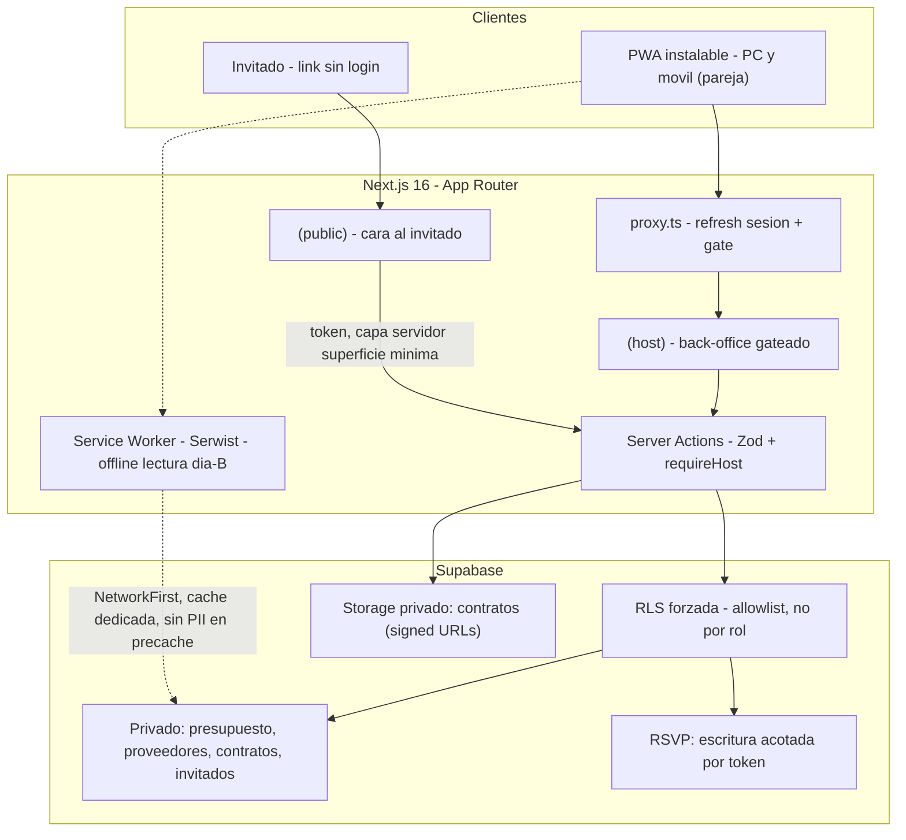

# feat: Boda-app — PWA de gestión de boda (hoja de ruta de las 3 fases)

> **Proyecto de referencia (patrones):** el proyecto hermano `my-app` (en el mismo directorio padre `Development/`) es una app Next.js 16 + Supabase ya construida. Sus convenciones se reutilizan tal cual; las referencias a `my-app/...` apuntan a ese proyecto como guía de patrón, no a este repo.
>
> **Alcance de este documento:** plan de **alto nivel cubriendo las 3 fases** (hoja de ruta global). Cada fase debería recibir su propio `/ce:plan` detallado antes de implementarla, expandiendo escenarios de test y decisiones de diseño. Los `**Files:**` y `**Test scenarios:**` por unidad son **dirección ilustrativa** para esos planes de fase, no un contrato vinculante; lo vinculante es la arquitectura, la secuencia y las decisiones técnicas transversales (Key Technical Decisions).

## Overview

Construir **boda-app**: una PWA para gestionar una sola boda (la del usuario), con dos superficies sobre un mismo backend:

1. **Back-office privado** (cuenta única, con login, instalable como PWA en PC y móvil).
2. **Cara al invitado** (pública, sin login, por link compartible): invitación digital, RSVP, web informativa y mesa de regalos.

Stack: **Next.js 16 (App Router, React 19) + Supabase (Postgres/Auth/Storage) + Tailwind v4 + Zod 4 + Playwright + pnpm**, replicando las convenciones de `my-app`. La novedad técnica respecto a `my-app` es la **capa PWA** (Serwist) y el **lienzo 2D** del plano de mesas (SVG + dnd-kit).

## Problem Frame

Organizar una boda dispersa la información en hojas de cálculo, chats y notas. El objetivo es centralizar *todo* (presupuesto, proveedores, invitados, confirmaciones, mesas, decoración) en una sola app, con una invitación digital que recoge confirmaciones sin trabajo manual. Ver origen: `docs/brainstorms/2026-06-22-boda-app-requirements.md`.

Riesgo de producto central (del brainstorm): **sobre-construir** la cara al invitado (commodity que cubren Zola/Bodas.net) en lugar de centrar el esfuerzo en el back-office de finanzas/proveedores y el plano. Mitigación adoptada: fases con MVP por módulo y la regla "todo funcionando antes que una fase perfecta".

## Requirements Trace

Del documento origen (todas las R se mantienen; agrupadas por fase de entrega):

- **R1–R5** Planificación y finanzas: presupuesto+pagos, proveedores+contratos, checklist → Fase 1.
- **R6** Lista de invitados → Fase 1 (es el backbone del que cuelga todo).
- **R7, R8, R15, R16** Invitación digital, RSVP (sin login + manual), pendientes+recordatorios → Fase 2.
- **R9, R10** Web informativa, mesa de regalos → Fase 2.
- **R11** Mesas (asignación funcional, núcleo) → Fase 3.
- **R12** Plano visual 2D (N2, MVP-first, capa de deleite sobre R11) → Fase 3.
- **R13** PWA instalable + login (cuenta única) → Fase 0 (cimientos).
- **R14** Aislamiento de datos público/privado (RLS) → Fase 0 (cimientos) + reforzado en Fase 2.
- **R17** Panel de inicio (dashboard) → Fase 1.
- **R18** Privacidad/RGPD → Fase 2.
- **R19** Vista de día-B (solo lectura + offline) → Fase 3.

## Scope Boundaries

- **Una sola boda.** Sin multi-tenant, sin planes/pagos de SaaS.
- **Cuenta única de back-office.** Sin gestión de usuarios, sin invitar/revocar terceros, sin roles granulares (R13).
- **Plano a nivel N2** (2D arrastrable, MVP-first). No N3 (medidas reales, biblioteca de decoración pro).
- **Solo PWA**, sin apps nativas. Offline = **lectura cacheada** el día-B, sin escritura offline ni sincronización.
- **Mesa de regalos sin pasarela de pago** (mostrar lista + datos de transferencia).

### Deferred to Separate Tasks

- **Plan detallado de cada fase:** este documento es la hoja de ruta; cada fase recibe su propio `/ce:plan` antes de implementarse.
- **Run-of-show (minuto a minuto), galería de fotos, pasarela de pago de regalos:** futuro, fuera de Fases 0–3.

## Context & Research

### Relevant Code and Patterns (proyecto de referencia `my-app`)

- **Split en route groups para auth:** `(public)` / `(host-public)/login` / `(host)` gateado. El login vive en su propio grupo para que el gate del layout no lo redirija a sí mismo (bucle). Ref: `my-app/src/app/(admin)/`.
- **Clientes Supabase (4), en `lib/supabase/`:** `server.ts` (session-bound, `await cookies()`, `setAll` en try/catch, `import 'server-only'`), `browser.ts`, `admin.ts` (service-role, **superficie mínima**: solo `uploadObject`/`deleteObject`, nunca `.from()`), `storage.ts`. Ref: `my-app/src/lib/supabase/`.
- **Auth triple:** `proxy.ts` (Next 16, no `middleware.ts`) refresca sesión + gate UX → `requireHost()` en DAL (`auth.getUser()` + allowlist, primera línea de cada página/acción privada) → **RLS** como frontera real. Ref: `my-app/src/proxy.ts`, `my-app/src/lib/supabase/dal.ts`.
- **Receta de Server Action:** `'use server'` → `requireHost()` (salvo la acción pública de RSVP) → `Schema.safeParse` → mutar vía cliente server-bound → `revalidatePath` → `redirect()` **fuera** del try/catch. Ref: `my-app/src/lib/actions/`.
- **Defensa en profundidad para input público:** Zod `.strict()` + CHECK en DB + honeypot + rate-limit por IP (sliding window). Ref: `my-app/src/lib/actions/quotes.ts`, `my-app/src/lib/rate-limit.ts`.
- **Migraciones SQL** numeradas e idempotentes (`IF NOT EXISTS`, `DROP POLICY IF EXISTS`), UUID PK `gen_random_uuid()`, trigger `set_updated_at()`, `FORCE ROW LEVEL SECURITY` en cada tabla. Ref: `my-app/supabase/migrations/`.
- **UI primitives hand-rolled** en `components/ui/` (sin Radix/shadcn); `cn()` = `twMerge(clsx())`; Tailwind v4 CSS-first con `@theme inline` (sin `tailwind.config.ts`). Ref: `my-app/src/components/ui/`, `my-app/src/app/globals.css`.
- **Playwright serial** (`workers: 1`, proyecto Supabase de test dedicado), auth fixture vía `storageState`. Ref: `my-app/playwright.config.ts`, `my-app/tests/e2e/`.

### Institutional Learnings (de `my-app/CLAUDE.md` y `docs/`)

- **No existe `docs/solutions/`** todavía. Conviene crear uno en boda-app y promover learnings según aparezcan (sobre todo de la capa PWA, que es terreno nuevo).
- **Recursión infinita en RLS:** la política de la **propia tabla allowlist** debe ser self-row check no recursivo (`USING (user_id = auth.uid())`), nunca `EXISTS (SELECT FROM allowlist ...)` sobre sí misma. Rompía todo el acceso autenticado.
- **Nunca autorizar solo por `auth.role() = 'authenticated'`.** Estar autenticado ≠ autorizado. Gatear por pertenencia a allowlist. (Crítico para R14.)
- **`service_role` bypasea RLS:** encapsular en módulo server-only de superficie mínima, nunca `NEXT_PUBLIC_`.
- **Convenciones Next.js 16:** `cookies()`/`params` async; `redirect()` lanza (fuera de try/catch); `proxy.ts` no `middleware.ts`; leer `node_modules/next/dist/docs/01-app/` antes de tocar auth/routing; evitar `'use cache'`.
- **Race de doble-POST** en formularios `useActionState`: short-circuit en submit vacío; inputs controlados; nunca eco del password.
- **Signup público desactivado + MFA TOTP** antes de producción; sesiones JWT 1h.

### External References (capa PWA y plano 2D)

- **PWA: Serwist (`@serwist/next`) — premisa a verificar con un spike.** ⚠️ **Corrección:** los docs de Next 16.2.4 incluidos en `my-app` (`node_modules/next/dist/docs/01-app/02-guides/progressive-web-apps.md`) dicen que Serwist **"currently requires webpack configuration"**, y Turbopack es el bundler por defecto en dev y build. Es decir, Serwist hereda el mismo problema que se le achaca a `next-pwa`. **Antes de comprometer U0.4, hacer un spike** que confirme build con Turbopack o mida el coste de `--webpack`. **Plan B:** un `sw.js` artesanal mínimo servido como estático cubre el offline-solo-lectura de R19 (sin Background Sync) sin acoplar el bundler. Manifest vía `app/manifest.ts` (file convention nativa); SW prod-only. Docs: https://nextjs.org/docs/app/guides/progressive-web-apps , https://serwist.pages.dev/docs/next/getting-started
- **Offline día-B:** `NetworkFirst` para datos de invitados/mesas (frescos con red, caché sin red), `CacheFirst` solo para estáticos versionados. **Nunca precachear PII**; cachear en runtime con `cacheName` dedicada + `ExpirationPlugin` (12h) y purgar al cerrar sesión. Cache Storage no está cifrado.
- **No cachear navegaciones RSC** (`?_rsc=`/header `Rsc`) ni Server Actions con estrategias agresivas → datos obsoletos. Servir `/sw.js` con `Cache-Control: no-store`.
- **Web Push:** estándar VAPID + `web-push`, suscripciones en tabla Supabase. **iOS solo con la PWA instalada en pantalla de inicio (iOS 16.4+)** → canal secundario, no fiable para avisos críticos.
- **Plano 2D = SVG** (DOM, no motor canvas): persistencia x/y limpia, impresión nativa excelente (`@media print` + `window.print()`), sin romper SSR (el editor es `'use client'`). ⚠️ **`my-app` ya tiene un patrón de drag SVG táctil reutilizable** (`my-app/src/components/sandbox/use-svg-drag.ts` con Pointer Events + `getScreenCTM().inverse()` + pointer capture, y un reducer puro `my-app/src/lib/sandbox/reducer.ts`). **Reutilizarlo es más coherente con "replicar `my-app`" que introducir dnd-kit**; comparar reuse vs dnd-kit en el `/ce:plan` de Fase 3. Pan/pinch-zoom no viene gratis con ninguna opción → se añade después.

## Key Technical Decisions

- **Replicar el stack y convenciones de `my-app`** en lugar de elegir de cero: reduce riesgo, reutiliza patrones probados de auth/RLS/Server Actions. Copiar el scaffold base (alias `@/*`, clientes Supabase, `cn`, UI primitives, `proxy.ts`, Playwright).
- **RLS como frontera de autorización, gateada por allowlist/cuenta-única, nunca por rol** (R14). Datos privados (presupuesto, proveedores, contratos, notas de invitados) inaccesibles para `anon`. La tabla allowlist usa self-row check no recursivo.
- **Escritura del RSVP por función Postgres `security definer` de superficie mínima (fork cerrado).** Tras revisión arquitectónica/seguridad/datos: la escritura del RSVP (que para un token de grupo toca varias filas y puede insertar el +1) se hace en **una única función `security definer` con `SET search_path = ''`** que recibe token + payload, valida el token y actualiza/inserta **solo las filas de ese token** en una sola transacción (garantiza atomicidad). Se **descarta `service_role`** (bypasea toda la RLS y reintroduciría `.from()` con privilegios totales en superficie pública); `service_role` queda **Storage-only sin `.from()`** (patrón `admin.ts` de `my-app`). Para el caso de **un solo invitado** (token por persona), un `UPDATE` anon-bound con RLS `WITH CHECK` (patrón `submitQuote`) también basta; se unifica en la función por coherencia. Defensa en profundidad: Zod `.strict()` + honeypot + rate-limit (por IP **y por token**) + `WITH CHECK` en DB.
- **Lectura pública por token con proyección de columnas (boundary nuevo).** A diferencia de `my-app` (la superficie pública solo escribe), aquí la invitación pública **lee** datos de invitado. Toda lectura pública pasa por una **función `security definer` read-only** (o vista) que devuelve **solo columnas en allowlist** (nombre para mostrar, scope del token, estado de confirmación) — nunca `SELECT *`, nunca `notes`/`phone`/`email`/`allergies` de otros miembros. `anon` no tiene SELECT directo sobre `guests`.
- **Mínimo privilegio intra-grupo.** Un link de grupo no debe exponer ni permitir editar alergias/notas de otros miembros más allá de lo necesario para confirmar; el formulario de grupo muestra solo nombre + estado de cada miembro. El RSVP público escribe **solo columnas propias del invitado** (`rsvp_status`, `menu`, `allergies`, `plus_one`, `message`), nunca columnas de gestión del host (`notes`, `household`, `table_id`) → reduce el conflicto last-write-wins casi a cero.
- **Trazabilidad de escritura (no locking optimista).** Cada fila de `guests` lleva `updated_at` (trigger) y `last_modified_source` (`guest`/`host`). La edición manual del host muestra "última actualización por invitado hace X" antes de sobrescribir. Se acepta last-write-wins **con trazabilidad**, no a ciegas.
- **Ciclo de vida del token como máquina de estados.** Estados `válido` / `caducado` / `revocado` (no `usado`: el RSVP es editable mientras el token sea válido). Caducidad ligada a la fecha del evento; revocación/regeneración desde el back-office (invalida el anterior). `token` con índice `UNIQUE` y ≥128 bits sin estructura. Vínculo token↔invitados como **tabla puente con FKs reales** (`ON DELETE CASCADE` desde `guests`).
- **Integridad del plano (R11/R12).** `guests.table_id` → mesa con `ON DELETE SET NULL` (borrar mesa = invitados a "sin sentar", nunca CASCADE). Para impedir asignar invitados a elementos no-mesa (pista/escenario/photocall), la mesa lógica (capacidad/etiqueta) se modela como entidad propia separada de `floor_plan_elements` (geometría), o un trigger garantiza `type='table'`. Mover una mesa (cambiar x/y) nunca toca `table_id`. La capacidad es **soft constraint** (aviso, no bloqueo duro) con recálculo en lectura.
- **`enum` nativo → `text` + `CHECK (col IN (...))`** para `rsvp_status`, estado de proveedor, estado de token y `type` de elemento: los enums nativos de Postgres son difíciles de evolucionar (no se borra un valor; `ALTER TYPE ADD VALUE` es irreversible). `text` + CHECK se modifica con `DROP/ADD CONSTRAINT` en una migración idempotente y encaja con la defensa en profundidad (Zod `.strict()` + CHECK).
- **Cabeceras de seguridad + sanitización (transversal, Fase 0).** HSTS, `frame-ancestors 'none'` para `(host)`, `X-Content-Type-Options: nosniff`, y `Referrer-Policy: no-referrer` en rutas con token (el token viaja en la URL → evitar fuga por `Referer`/logs/embeds; mapa de U2.5 como enlace, no embed). **CSP permisiva en dev, estricta en prod**; ⚠️ `my-app` no tiene `headers()` (no hay patrón que copiar) y una CSP estricta sin `unsafe-inline` en App Router exige **nonces por petición → fuerza dynamic rendering** y afecta la cacheabilidad de la cara pública: el modelo (nonce vs hash vs `style-src` tolerado por Tailwind) se decide en el `/ce:plan` de Fase 0. Todo contenido generado por invitado (mensaje, nombre +1) se **escapa como HTML** (React por defecto; nunca `dangerouslySetInnerHTML`) antes de mostrarse en el back-office y en export/print (riesgo de XSS almacenado en sesión privilegiada).
- **Modelo de link híbrido (R8):** por persona por defecto, con opción de link de grupo para hogares (ver el ciclo de vida del token en la decisión de máquina de estados arriba).
- **PWA con SW prod-only, offline solo lectura** (R13/R19). Sin escritura offline → no hace falta Background Sync ni colas. (Serwist vs SW artesanal: ver External References / U0.4.)
- **Plano 2D con SVG (R12), MVP-first**, reutilizando el patrón de drag SVG de `my-app` (no dnd-kit por defecto), con **separación esquema espacial / vínculo lógico**: geometría separada de `guests.table_id` (asignación). Permite asignar invitados a mesas (R11) sin que exista aún el lienzo, y recolocar mesas sin tocar asignaciones.
- **Tipos de Supabase generados pronto** (`pnpm generate:types`) contra un proyecto real; nombres de buckets/columnas desde las migraciones, nunca hard-coded.
- **Copy en español** (locale `es`/`es-DO`); inglés solo para tecnología (env vars, código, logs).

## Open Questions

### Resolved During Planning

- **¿`next-pwa` o Serwist?** → Serwist como primera opción **pendiente de spike** (los docs de Next 16.2.4 indican que Serwist también requiere webpack); plan B: SW artesanal mínimo. Ver External References / U0.4.
- **¿Librería del plano 2D?** → SVG (DOM), **reutilizando el patrón de drag de `my-app`** (`use-svg-drag.ts` + reducer puro); comparar con dnd-kit en el `/ce:plan` de Fase 3.
- **¿Cómo aísla datos privados de la superficie pública?** → RLS forzada por allowlist + escritura RSVP por capa servidor de superficie mínima (patrón `my-app`).
- **¿RSVP solo por link?** → No; R15 añade confirmación/edición manual desde el back-office (familiares mayores).
- **¿Geometría del plano en el JSON del layout junto al `table_id`?** → No; tablas separadas (espacial vs lógico).
- **¿Cómo escribe el RSVP (`service_role` vs `security definer`)?** → Función `security definer` de superficie mínima (atomicidad de grupo + sin blast radius de `service_role`). Ver Key Technical Decisions.
- **¿`ON DELETE` de `guests.table_id`?** → `SET NULL` (borrar mesa → "sin sentar").
- **¿Borrado RGPD de alergias?** → Job programado (pg_cron/scheduled function), **no** migración de esquema; borrado **físico** (NULL), no soft-delete; columna nullable; toda lectura tolera NULL.
- **¿Consentimiento del Art. 9 (alergias)?** → **Gate de release de Fase 2**: consentimiento explícito y separado (checkbox propio, no premarcado, distinto del aviso general); poder asistir sin declarar alergias.

### Deferred to Implementation

- **Contratos (R4): ¿Storage privado + signed URLs o enlace externo?** Decidir al implementar Fase 1 según si se quiere custodia dentro de la app. Por defecto: campo de enlace externo en MVP, Storage privado si se necesita subir.
- **Relación invitación ↔ web informativa (R7/R9):** → **rutas separadas** (`/i/[token]` invitación+RSVP; `/info` web+regalos); la navegación fina entre ellas se detalla en el `/ce:plan` de Fase 2.
- **Presupuesto "real" (R1):** ¿suma automática de pagos (R2) o entrada manual? Decidir con el esquema real en Fase 1.
- **Modelo del +1 (R6/R8):** ¿fila placeholder o creación al confirmar? Es **decisión de entrada de U2.1** (define la firma de la función de escritura del RSVP): resolver al inicio del `/ce:plan` de Fase 2, antes de U2.1.
- **Estados de interacción y vacíos** (RSVP enviado/editado/caducado/inválido, contenido semilla de checklist/categorías, edición inline vs modal): detallar en el `/ce:plan` de cada fase.
- **Web Push (R2/R5/R8):** in-app primero; push/email proactivo es opcional y posterior (scheduler + canal). El push iOS depende de instalación.
- **Navegación PC vs móvil** (sidebar vs bottom-nav) y jerarquía del dashboard: detallar al implementar Fase 1.
- **Base jurídica y plazo de retención RGPD (R18):** redactar el aviso y fijar el plazo de borrado de alergias antes de publicar la Fase 2.

## Output Structure

    boda-app/
      AGENTS.md                      # shim Next.js 16 (leer node_modules/next/dist/docs antes de tocar Next)
      next.config.ts                 # headers() de seguridad; images.remotePatterns; (envoltura Serwist sujeta a spike)
      postcss.config.mjs             # Tailwind v4 (sin tailwind.config.ts)
      playwright.config.ts           # serial, webServer, storageState
      src/
        proxy.ts                     # Next 16: refresh de sesión + gate de /host
        app/
          manifest.ts                # PWA manifest (MetadataRoute.Manifest)
          sw.ts                      # service worker prod-only (Serwist o artesanal — ver spike U0.4)
          layout.tsx  globals.css    # tokens @theme inline (OKLCH)
          (public)/                  # cara al invitado (sin login)
            i/[token]/               # invitación + formulario RSVP por token
            info/                    # web informativa + mesa de regalos
            ~offline/                # fallback offline
          (host-public)/login/       # login (fuera del gate)
          (host)/                    # back-office gateado por requireHost()
            page.tsx                 # panel de inicio (dashboard, R17)
            invitados/  presupuesto/  proveedores/  tareas/  mesas/  dia-b/
        components/  ui/  host/  public/  plano/   # plano/ = editor SVG+dnd-kit
        lib/
          supabase/  server.ts browser.ts admin.ts storage.ts dal.ts types.ts
          actions/   auth.ts invitados.ts presupuesto.ts proveedores.ts tareas.ts rsvp.ts mesas.ts
          utils/cn.ts   rate-limit.ts
      supabase/
        migrations/  init · rls · guests · vendors · budget · tasks · tokens · public_rsvp · retention · floor_plan
                     # numerados 0001..NNNN, únicos y monotónicos; cada tabla trae su propia FORCE RLS
        seed.sql
      docs/
        brainstorms/   plans/   solutions/   # solutions/ nuevo: promover learnings

## High-Level Technical Design

> *Esto ilustra el enfoque previsto y es guía direccional para revisión, no una especificación de implementación. El agente implementador debe tratarlo como contexto, no como código a reproducir.*

## Implementation Units

### Fase 0 · Cimientos (transversal, antes que todo)

- [ ] **U0.1: Scaffold del proyecto (stack + convenciones de `my-app`)**

**Goal:** Proyecto Next.js 16 + Supabase + Tailwind v4 + Zod + Playwright arrancando, con las convenciones de `my-app`.
**Requirements:** R13 (base), habilita todo lo demás.
**Dependencies:** Ninguna.
**Files:**
- Create: `package.json`, `next.config.ts`, `postcss.config.mjs`, `tsconfig.json` (alias `@/*`), `src/app/layout.tsx`, `src/app/globals.css` (`@theme inline`), `src/lib/utils/cn.ts`, `src/components/ui/*` (button, input, field, card, dialog, label, select, textarea), `AGENTS.md`.
**Approach:** Copiar estructura de `my-app`: route groups `(public)`/`(host-public)`/`(host)`, primitives UI hand-rolled, `cn()`, tokens OKLCH en `@theme`. pnpm. Sin `tailwind.config.ts`.
**Patterns to follow:** `my-app/` (raíz, `src/components/ui/`, `src/app/globals.css`, `AGENTS.md`).
**Test scenarios:** Test expectation: none — scaffolding/configuración sin comportamiento. Verificación por arranque y smoke e2e en U0.3.
**Verification:** `pnpm dev` levanta; `/` renderiza; lint/typecheck limpios.

- [ ] **U0.2: Modelo de datos base + arquitectura RLS (frontera público/privado)**

**Goal:** Esquema inicial y políticas RLS que aíslan datos privados de la superficie pública anónima.
**Requirements:** R14.
**Dependencies:** U0.1.
**Files:**
- Create: `supabase/migrations/0001_init.sql` (tabla de cuenta/allowlist del host, `wedding` config singleton, trigger `set_updated_at`, pgcrypto), `supabase/migrations/0002_rls.sql` (FORCE RLS + políticas), `src/lib/supabase/types.ts`.
**Approach:** Allowlist con self-row check no recursivo. **Cada migración que crea una tabla trae su propia FORCE RLS + políticas** (no centralizar todo en una sola; los números de migración son ilustrativos y deben ser únicos y monotónicos). `wedding` config: separar **columnas/tabla públicas** (fecha, ubicación, dress code — con `anon SELECT` proyectado) de la config privada; forzar el singleton en DB (`CHECK (id = 1)` o índice único parcial). `anon` sin acceso a tablas privadas. Migraciones idempotentes.
**Patterns to follow:** `my-app/supabase/migrations/0002_rls_policies.sql`, `my-app/supabase/migrations/0004_fix_app_admins_recursion.sql`.
**Test scenarios:**
- Integración (RLS): con clave `anon`, `SELECT` sobre tablas privadas devuelve 0 filas / error → confirma aislamiento.
- Integración (exhaustivo, **opcional/post-MVP**): enumera todas las tablas y verifica `rowsecurity=true` + FORCE RLS + sin grant `anon` salvo allowlist → detecta tablas nuevas sin clasificar. La defensa real es allowlist + FORCE RLS por migración; este gate es endurecimiento, no MVP.
- Integración: con sesión del host (en allowlist), CRUD sobre tablas privadas funciona.
- Edge: la política de la propia tabla allowlist no provoca recursión (login no rebota).
**Verification:** Tests de RLS pasan; `anon` no puede leer datos privados; ninguna tabla queda sin clasificar.

- [ ] **U0.3: Auth del back-office (cuenta única)**

**Goal:** Login y gate de `/host` con el triple proxy + `requireHost()` + RLS.
**Requirements:** R13.
**Dependencies:** U0.1, U0.2.
**Files:**
- Create: `src/proxy.ts`, `src/lib/supabase/server.ts`, `src/lib/supabase/browser.ts`, `src/lib/supabase/dal.ts` (`verifySession`, `requireHost`), `src/lib/actions/auth.ts` (`loginAction`, `logoutAction`), `src/app/(host-public)/login/page.tsx`, `src/components/host/login-form.tsx`.
**Approach:** Replicar el patrón de `my-app`. Signup público desactivado; cuenta creada desde el dashboard de Supabase; MFA TOTP antes de producción. Login en su route-group; no rebotar autenticados fuera de login.
**Execution note:** Empezar con un test e2e del flujo de login (form real) antes de pulir UX.
**Patterns to follow:** `my-app/src/proxy.ts`, `my-app/src/lib/supabase/dal.ts`, `my-app/src/lib/actions/auth.ts`, `my-app/src/components/admin/login-form.tsx`.
**Test scenarios:**
- Happy path: credenciales válidas → redirige a `/host`.
- Error: credenciales inválidas → error genérico (sin enumeración de email); inputs conservan valores.
- Edge: submit vacío (doble-POST) → no muestra errores fantasma.
- Integración: acceso a `/host/*` sin sesión → redirige a login; Server Action privada sin sesión → bloqueada por `requireHost()`.
**Verification:** e2e de login/logout y de gate pasan.

- [ ] **U0.4: Shell PWA (manifest + Serwist, offline base)**

**Goal:** App instalable con service worker prod-only y ruta offline de fallback.
**Requirements:** R13.
**Dependencies:** U0.1.
**Files:**
- Create: `src/app/manifest.ts`, `src/app/sw.ts`, iconos en `public/` (192/512), `src/app/(public)/~offline/page.tsx`; Modify: `next.config.ts` (`withSerwistInit`, headers `Cache-Control: no-store` para `/sw.js`), `tsconfig.json`, `.gitignore`.
**Approach:** Serwist con `disable` en dev; `defaultCache`. **Fijar aquí el contrato del SW** (cacheNames, estrategias y exclusiones) para que U3.3 solo *añada* una cacheName dedicada, no rediseñe el SW en Fase 3. Excluir navegaciones RSC y Server Actions **por cabecera** (`RSC`, `Next-Router-Prefetch`, `Next-Action`), no solo por `?_rsc=`. Invariante cruzado: `revalidatePath` (U1.5) solo es fiable si el SW nunca sirve payloads RSC. Probar instalabilidad contra build de producción con HTTPS.
**Patterns to follow:** Docs Serwist/Next 16 (sin precedente en `my-app`). Documentar en `docs/solutions/`.
**Test scenarios:**
- Happy path: manifest válido (DevTools → Application lista la app como instalable).
- Integración: en build de producción el SW se registra; la ruta `~offline` se sirve sin red.
- Edge: mutación (Server Action) seguida de navegación no sirve estado obsoleto desde el SW.
**Verification:** Lighthouse PWA installable; SW activo solo en prod; sin staleness RSC.

- [ ] **U0.5: Cabeceras de seguridad + CSP (transversal)**

**Goal:** Endurecer toda la app (pública y privada) con cabeceras de seguridad desde los cimientos.
**Requirements:** R14, R18 (base de seguridad).
**Dependencies:** U0.1.
**Files:** Modify: `next.config.ts` (o `src/proxy.ts`) para `headers()`. Test: `tests/e2e/security-headers.spec.ts`.
**Approach:** CSP estricta (sin `unsafe-inline`), HSTS, `frame-ancestors 'none'` para `(host)`, `X-Content-Type-Options: nosniff`, `Referrer-Policy: no-referrer` en rutas con token (`/i/[token]`, `/info`). HTTPS obligatorio. Base para evitar XSS/clickjacking/fuga de tokens antes de que exista superficie pública.
**Test scenarios:**
- Happy path: respuestas llevan las cabeceras esperadas.
- Edge: rutas con token responden `Referrer-Policy: no-referrer`; `(host)` no embebible en iframe.
**Verification:** Cabeceras presentes; escaneo básico sin findings de cabeceras.

### Fase 1 · Núcleo privado

- [ ] **U1.1: Lista de invitados (backbone)**

**Goal:** CRUD de invitados con agrupación por hogares, +1, contacto, estado RSVP, menú/alergias, notas; lista con búsqueda y filtros.
**Requirements:** R6.
**Dependencies:** Fase 0.
**Files:** Create: `supabase/migrations/0003_guests.sql`, `src/lib/actions/invitados.ts`, `src/app/(host)/invitados/page.tsx`, `src/components/host/guest-list.tsx`, `src/components/host/guest-form.tsx`. Test: `tests/e2e/host-invitados.spec.ts`.
**Approach:** Tabla `guests`: `household`/grupo, `plus_one`, `rsvp_status` (**`text`+CHECK**, `NOT NULL DEFAULT 'pending'`), `menu`, `allergies` (nullable), `notes`, `updated_at` (trigger) y `last_modified_source` (`text`, `guest`/`host`, default `'host'`). Estas dos últimas se crean **desde ya** (la lógica de Fase 2 las usa y `guests` es la tabla central → evitar un ALTER posterior). Filtros por estado y (más tarde) por mesa. Receta de Server Action de `my-app`.
**Patterns to follow:** `my-app/src/lib/actions/products.ts`, `my-app/src/lib/supabase/dal.ts` (paginación/filtros).
**Test scenarios:**
- Happy path: crear/editar/borrar invitado; aparece en la lista.
- Edge: invitado sin email; +1 sin nombre; hogar con varios miembros.
- Filtro: por estado RSVP devuelve el subconjunto correcto.
- Integración: cambiar `rsvp_status` se refleja en lista y (futuro) en dashboard.
**Verification:** e2e de CRUD y filtros pasan.

- [ ] **U1.2: Proveedores + contratos**

**Goal:** Directorio de proveedores con estado del trato y documentos asociados.
**Requirements:** R3, R4.
**Dependencies:** Fase 0.
**Files:** Create: `supabase/migrations/0004_vendors.sql`, `src/lib/actions/proveedores.ts`, `src/app/(host)/proveedores/page.tsx`. (Storage privado opcional: `src/lib/supabase/admin.ts`/`storage.ts`.) Test: `tests/e2e/host-proveedores.spec.ts`.
**Approach:** `status` como enum simple (contactado/presupuestado/contratado), sin lógica de transición. Contratos: campo de enlace externo en MVP; bucket privado + signed URLs si se sube archivo (decisión diferida).
**Patterns to follow:** `my-app/src/lib/actions/products.ts`; subida con MIME allowlist + magic-byte si se usa Storage (`my-app` upload pattern).
**Test scenarios:**
- Happy path: alta de proveedor con estado; cambio de estado.
- Error: importe inválido rechazado por Zod.
- Integración (si Storage): subir contrato → solo accesible vía signed URL autenticada; `anon` no accede.
**Verification:** CRUD y, si aplica, acceso a contrato restringido.

- [ ] **U1.3: Presupuesto + pagos**

**Goal:** Presupuesto por categorías (previsto vs real) y seguimiento de pagos por proveedor.
**Requirements:** R1, R2.
**Dependencies:** U1.2 (proveedores).
**Files:** Create: `supabase/migrations/0005_budget.sql`, `src/lib/actions/presupuesto.ts`, `src/app/(host)/presupuesto/page.tsx`. Test: `tests/e2e/host-presupuesto.spec.ts`.
**Approach:** Categorías con `previsto`; pagos vinculados a proveedor (`anticipo`, `pagado`, `fecha`). "Real" = suma de pagos (decisión diferida confirmada en implementación). Aviso de pagos próximos **in-app**.
**Test scenarios:**
- Happy path: crear categoría/pago; previsto vs real cuadra.
- Edge: pago sin fecha; importe 0; suma de pagos = real.
- Integración: pago próximo aparece en el indicador / dashboard.
**Verification:** Cálculos correctos; indicador de pagos próximos visible.

- [ ] **U1.4: Checklist de tareas**

**Goal:** Tareas con fecha, ordenadas por urgencia (in-app, sin notificaciones proactivas).
**Requirements:** R5.
**Dependencies:** Fase 0.
**Files:** Create: `supabase/migrations/0006_tasks.sql`, `src/lib/actions/tareas.ts`, `src/app/(host)/tareas/page.tsx`. Test: `tests/e2e/host-tareas.spec.ts`.
**Approach:** Tabla `tasks` (título, fecha límite, hecho). Orden por fecha. Contenido semilla (plantilla de boda) — diferido a diseño.
**Test scenarios:**
- Happy path: crear/completar tarea; orden por urgencia.
- Edge: tarea sin fecha al final; tarea vencida resaltada.
**Verification:** Lista ordenada y estado completado persisten.

- [ ] **U1.5: Panel de inicio (dashboard)**

**Goal:** Resumen accionable: previsto/gastado/pendiente, % confirmados, sin sentar, pagos/tareas próximas.
**Requirements:** R17.
**Dependencies:** U1.1–U1.4.
**Files:** Create: `src/app/(host)/page.tsx`, `src/components/host/dashboard/*`. Test: `tests/e2e/host-dashboard.spec.ts`.
**Approach:** Lectura agregada vía DAL (no `React.cache` para reflejar escrituras tras `revalidatePath`). Jerarquía visual según el momento (presupuesto al principio; confirmados/sin sentar cerca de la fecha) — diseño diferido.
**Test scenarios:**
- Happy path: con datos de prueba, cada métrica refleja el estado real.
- Edge: estado vacío (sin invitados/pagos) muestra ceros y CTAs, no errores.
- Integración: tras crear un pago, el dashboard lo refleja (revalidación).
**Verification:** Métricas correctas y estados vacíos cuidados.

### Fase 2 · Cara al invitado

- [ ] **U2.1: Frontera pública + tokens + escritura RSVP segura**

**Goal:** Infraestructura del modelo híbrido de links, tokens de alta entropía y escritura del RSVP por capa servidor de superficie mínima.
**Requirements:** R8 (seguridad), R14.
**Dependencies:** Fase 0–1.
**Files:** Create: `supabase/migrations/000N_invite_tokens.sql` (tabla `invite_tokens` + puente `token_guests`), `supabase/migrations/000N_public_rsvp.sql` (función `security definer` de escritura + función read-only proyectada), `src/lib/rate-limit.ts`, `src/lib/actions/rsvp.ts`. Test: `tests/e2e/public-rsvp-security.spec.ts`.
**Approach:** `invite_tokens` (token ≥128 bits `UNIQUE`, scope persona|grupo, estado `text+CHECK` válido/caducado/revocado, caducidad ligada a la fecha del evento). Vínculo token↔invitados: tabla puente `token_guests` (FKs reales, `ON DELETE CASCADE` desde `guests`) **o**, más simple, columna `token_id` en `guests` — decidir en el `/ce:plan` de Fase 2. El **modelo del +1** (entrada de la función de escritura) se fija al inicio de ese plan, antes de esta unidad. Escritura RSVP: **función `security definer` (`SET search_path=''`, todo calificado con `public.`)** que valida token y actualiza/inserta solo las filas de ese token en una transacción; enumerar sus modos de fallo (token inválido/caducado/revocado, fila inexistente, CHECK violado) y el contrato de retorno. Lectura pública: **función read-only proyectada por columnas** (no `SELECT` directo de `guests`). Zod `.strict()` + honeypot + rate-limit por IP y **por token** (este último solo es defensa real con store persistente compartido —tabla Postgres o Upstash—; el de `my-app` es en memoria/fail-open → la defensa principal contra enumeración es el token ≥128 bits + caducidad) + respuestas/timing uniformes.
**Patterns to follow:** `my-app/src/lib/actions/quotes.ts` (público), `my-app/src/lib/supabase/admin.ts` (superficie mínima), `my-app/src/lib/rate-limit.ts`.
**Test scenarios:**
- Happy path: token válido escribe las filas correctas (incl. grupo, atómico).
- Error/seguridad: token inválido/caducado/**revocado** → rechazado; **regenerar** invalida el anterior; un token no modifica filas de otro grupo; honeypot → ignorado; exceso por IP o por token → rate-limited.
- Lectura: la respuesta pública por token **no** contiene `notes`/`phone`/`email`/`allergies` de otros miembros.
- Integración: `anon` no puede `SELECT` directo sobre `guests`; solo vía la función por token válido.
**Verification:** Suite de seguridad del RSVP pasa; mínimo privilegio y proyección de lectura confirmados.

- [ ] **U2.2: Invitación digital**

**Goal:** Invitación de diseño único configurable, con previsualización y link compartible por WhatsApp.
**Requirements:** R7.
**Dependencies:** U2.1.
**Files:** Create: `src/app/(public)/i/[token]/page.tsx` (`await params`), `src/components/public/invitation.tsx`, `src/components/host/invitation-config.tsx`. Test: `tests/e2e/public-invitation.spec.ts`.
**Approach:** Config (foto, título, fecha/hora, mensaje, botón RSVP) editable desde el back-office con previsualización antes de publicar. Ruta dinámica por token (`params` Promise).
**Test scenarios:**
- Happy path: link válido muestra la invitación personalizada.
- Edge: token inválido → página de error útil (no 500).
- Happy path: botón de compartir genera el mensaje/URL correcto.
**Verification:** Invitación renderiza por token; previsualización fiel.

- [ ] **U2.3: RSVP público + RSVP manual**

**Goal:** Formulario RSVP sin login (híbrido persona/grupo, editable) que alimenta la lista; y confirmación/edición manual desde el back-office.
**Requirements:** R8, R15.
**Dependencies:** U2.1, U2.2, U1.1.
**Files:** Create: `src/components/public/rsvp-form.tsx`; Modify: `src/lib/actions/rsvp.ts`, `src/lib/actions/invitados.ts` (confirmar/editar manual). Test: `tests/e2e/public-rsvp.spec.ts`.
**Approach:** Formulario multi-persona cuando el token es de grupo; campos: asistencia, menú, alergias (**opcional**), +1, mensaje. El formulario de grupo **no muestra alergias/notas previas de otros miembros** (solo nombre + estado). El RSVP escribe **solo columnas propias del invitado** (`rsvp_status`/`menu`/`allergies`/`plus_one`/`message`), nunca `notes`/`household`/`table_id`. Todo texto libre se **escapa/sanea** antes de mostrarse en el back-office. Editable mientras el token sea válido. Aviso de privacidad visible (R18). Manual: el host edita cualquier invitado; la UI muestra `last_modified_source`/`updated_at` ("actualizado por invitado hace X") antes de sobrescribir.
**Test scenarios:**
- Happy path: invitado confirma → aparece en la lista sin acción manual (hito de éxito).
- Edge: grupo con un miembro confirmado y otro no (estado mixto válido); reabrir link tras confirmar → puede editar; el formulario no filtra alergias ajenas.
- Seguridad: payload `<script>`/`` en mensaje no ejecuta en el back-office (sanitizado).
- Integración: confirmación manual del host y RSVP público convergen en la misma fila; `last_modified_source` refleja el origen.
**Verification:** RSVP público y manual convergen; sin XSS; trazabilidad de origen.

- [ ] **U2.4: Pendientes de confirmar + recordatorios**

**Goal:** Vista accionable de quién no ha respondido y reenvío del link.
**Requirements:** R16.
**Dependencies:** U1.1, U2.2.
**Files:** Create: `src/app/(host)/invitados/pendientes/page.tsx` (o filtro), `src/components/host/rsvp-reminders.tsx`. Test: `tests/e2e/host-pendientes.spec.ts`.
**Approach:** Filtro sobre datos existentes (estado != confirmado) + acción de reenvío (copiar/compartir link). Notificación proactiva = futuro.
**Test scenarios:**
- Happy path: lista solo pendientes; reenviar genera el link correcto.
- Edge: 0 pendientes → estado vacío "todos confirmados".
**Verification:** Filtro y reenvío correctos.

- [ ] **U2.5: Web informativa + mesa de regalos**

**Goal:** Página pública de info (ubicación/mapa, horario, dress code, alojamiento, transporte) + lista de regalos con datos de transferencia.
**Requirements:** R9, R10.
**Dependencies:** Fase 0; relación con U2.2 (misma URL o separada — diferido).
**Files:** Create: `src/app/(public)/info/page.tsx`, `src/components/public/info-sections.tsx`, `src/components/host/info-config.tsx`. Test: `tests/e2e/public-info.spec.ts`.
**Approach:** Contenido configurable desde el back-office. Mapa como embed/enlace. IBAN con `noindex` (robots) por riesgo de phishing/indexación. Mesa de regalos = sección ligera.
**Test scenarios:**
- Happy path: secciones configuradas se muestran al invitado.
- Edge: sección vacía se oculta; página marcada `noindex`.
**Verification:** Info pública correcta; IBAN no indexable.

- [ ] **U2.6: Privacidad / RGPD**

**Goal:** Aviso de privacidad en la cara pública, alergias como dato opcional de salud, política de retención/borrado.
**Requirements:** R18.
**Dependencies:** U2.3.
**Files:** Create: `src/components/public/privacy-notice.tsx`, `src/components/public/health-consent.tsx`, `supabase/migrations/000N_retention.sql` (crea la **infraestructura** del job: pg_cron/scheduled function, no borra en deploy), `src/lib/actions/invitados.ts` (acción de borrado/exportación por invitado). Test: `tests/e2e/public-privacy.spec.ts`.
**Approach:** Texto Art. 13 (finalidad, responsable, conservación, derechos, encargado=Supabase **región UE**) en el RSVP. **Gate de release:** consentimiento explícito y **separado** para alergias (checkbox propio, no premarcado, distinto del aviso general — Art. 9.2.a); poder asistir sin declarar alergias. Retención: **dos plazos** (alergias/menú borradas a los pocos días post-evento; resto con plazo definido) mediante **borrado físico** (NULL, no soft-delete); `allergies` nullable y toda lectura tolera NULL; el borrado también purga la caché offline (U3.3). Derechos del interesado operacionalizados: canal de contacto + acción de borrado/exportación por invitado en el back-office (revoca también el token). Notificaciones/push **nunca** incluyen PII ni alergias.
**Test scenarios:**
- Happy path: aviso visible antes de enviar; no se puede enviar alergias sin marcar el consentimiento de salud específico.
- Edge: RSVP sin alergias se acepta (opcional); tras el borrado de retención, vista día-B y dashboard renderizan sin alergias y sin error.
**Verification:** Consentimiento separado operativo; borrado físico efectivo; lecturas toleran NULL.

### Fase 3 · Distribución del espacio

- [ ] **U3.1: Mesas (asignación funcional — núcleo)**

**Goal:** Crear mesas con capacidad y asignar invitados desde lista; ver capacidad usada y sin sentar.
**Requirements:** R11.
**Dependencies:** U1.1 (invitados), confirmaciones de Fase 2.
**Files:** Create: `supabase/migrations/000N_floor_plan.sql` (entidad lógica `tables` + `floor_plan_elements` geometría + FK `guests.table_id`), `src/lib/actions/mesas.ts`, `src/app/(host)/mesas/page.tsx`, `src/components/host/seating-list.tsx`. Test: `tests/e2e/host-mesas.spec.ts`.
**Approach:** **Separar** la **mesa lógica** (capacidad/etiqueta, lo asignable) de la **geometría** (`floor_plan_elements`: type, x, y, w/h, rotation; elementos no-mesa como pista/escenario no son asignables). `guests.table_id` → mesa lógica con **`ON DELETE SET NULL`** (borrar mesa = "sin sentar", nunca CASCADE); trigger/FK garantiza que solo apunta a mesas, no a decoración. Capacidad como **soft constraint** (aviso, recálculo en lectura), no bloqueo duro. Asignación desde lista (sin lienzo aún) → cumple ya el criterio de éxito de "sentar a todos".
**Patterns to follow:** Esquema espacial/lógico de la investigación; Server Actions de `my-app`.
**Test scenarios:**
- Happy path: crear mesa; asignar invitado; capacidad usada sube.
- Edge: asignar a mesa llena → bloqueado/avisado; invitado sin confirmar → permitido pero marcado; quitar asignación.
- Integración: "sin sentar" refleja invitados confirmados sin mesa.
**Verification:** Asignación y conteos correctos sin necesidad del lienzo.

- [ ] **U3.2: Plano visual 2D (SVG, MVP-first)**

**Goal:** Lienzo arrastrable construido sobre U3.1: mesas como formas, arrastrar invitados a mesas; luego decoración; luego zoom/pan; luego export/print.
**Requirements:** R12.
**Dependencies:** U3.1.
**Files:** Create: `src/components/plano/floor-plan-editor.tsx` (`'use client'`), `src/components/plano/elements/*`, `src/lib/plano/reducer.ts`; Modify: `src/lib/actions/mesas.ts` (persistir x/y debounced). Test: `tests/e2e/host-plano.spec.ts` + unit del reducer de layout.
**Approach:** SVG **reutilizando el patrón de drag de `my-app`** (`use-svg-drag.ts` con Pointer Events + `getScreenCTM().inverse()` + pointer capture, y reducer puro); evaluar dnd-kit solo si aporta sobre el hook existente. Estado en React, persistencia x/y **debounced** (~600ms) al terminar el drag (un `update` por elemento). MVP: mesas redondas/rectangulares + arrastrar invitados. Después: `dance_floor`/`stage`/`photobooth` (no asignables). Después: pan/pinch-zoom (`<g transform>`, no viene gratis con ninguna opción). Después: export/print (`@media print` + `window.print()`; PDF con jsPDF on-demand).
**Patterns to follow:** `my-app/src/components/sandbox/use-svg-drag.ts`, `my-app/src/lib/sandbox/reducer.ts` (drag SVG táctil + reducer puro ya probados); separación espacial/lógico.
**Test scenarios:**
- Happy path: arrastrar mesa persiste x/y; arrastrar invitado a mesa setea `table_id`.
- Edge: soltar invitado en mesa llena → rechazado; mover mesa no altera asignaciones; recargar restaura el layout.
- Integración: cambios del lienzo y de la lista (U3.1) son consistentes (mismo `table_id`).
**Verification:** Layout persiste y se restaura; asignación por arrastre coincide con la lista.

- [ ] **U3.3: Vista de día-B (solo lectura + offline)**

**Goal:** Vista móvil de solo lectura (quién se sienta dónde, alergias, contactos clave) consultable offline el día del evento.
**Requirements:** R19, R13 (offline).
**Dependencies:** U3.1, U0.4.
**Files:** Create: `src/app/(host)/dia-b/page.tsx`, `src/components/host/day-of-view.tsx`; Modify: `src/app/sw.ts` (runtimeCaching `NetworkFirst` para datos día-B). Test: `tests/e2e/host-dia-b.spec.ts`.
**Approach:** `NetworkFirst` con `cacheName` dedicada (añadida al contrato de SW fijado en U0.4) + `ExpirationPlugin` (12h); **no precachear PII**. Purga **en logout** (`postMessage` al SW o `caches.delete` tras el redirect) **y proactiva por tiempo** (borrar la caché pasada la fecha del evento + margen, no depender solo del logout). Sesión corta (JWT 1h) para acotar el dispositivo perdido. Minimizar la PII de salud cacheada a lo imprescindible para el caso de uso. Solo lectura — offline el gate de servidor no aplica; el control recae en bloqueo del dispositivo + sesión corta.
**Test scenarios:**
- Happy path: vista muestra mesas + invitados + alergias.
- Integración (offline): con red caída, la última copia se sirve; con red, datos frescos.
- Seguridad: la caché de PII se purga en logout y caduca por tiempo post-evento.
**Verification:** Vista usable offline; PII no persiste tras logout ni pasada la ventana del evento.

## System-Wide Impact

- **Interaction graph:** el RSVP público (U2.3) y la confirmación manual (U2.3) escriben en `guests`, que alimenta dashboard (U1.5), pendientes (U2.4) y mesas (U3.1). Cambiar el esquema de `guests` afecta a casi todo.
- **Error propagation:** Server Actions mapean códigos PG conocidos (23505/23503) a mensajes amables; nunca eco de errores crudos de Supabase. Páginas degradan a estado vacío en vez de 500.
- **State lifecycle risks:** "atomicidad ante fallo" (todo o nada, vía la función `security definer`) ≠ "estado mixto de negocio" (un grupo puede quedar 2 sí / 3 no de forma válida); idempotencia ante doble-POST; last-write-wins **con trazabilidad** (`last_modified_source`) y escritura por columnas propias para minimizar conflicto; capacidad de mesa como soft constraint (posible sobre-aforo con dos pestañas, recalculado en lectura).
- **Boundary público nuevo:** la lectura por token expone PII de `guests` a `anon` — tratada con función read-only proyectada por columnas (no existe en `my-app`); es el punto más delicado de la arquitectura.
- **API surface parity:** la regla "primera línea `requireHost()`" aplica a **toda** Server Action privada (el gate del layout no cubre los POST de actions).
- **Integration coverage:** la frontera `anon` vs privado (U0.2/U2.1) necesita tests de integración reales contra Supabase, no solo mocks; incluido un test que **enumera todas las tablas** (FORCE RLS + sin grant `anon` salvo allowlist) como gate de CI.
- **Offline y gate de servidor:** offline, `proxy.ts`/`requireHost()` no validan contra Supabase; el control de acceso de la vista día-B recae en el bloqueo del dispositivo + sesión corta + purga proactiva por tiempo, no en el gate de servidor.
- **Unchanged invariants:** se reutiliza el modelo de auth de `my-app` sin cambiarlo; mover una mesa nunca altera `guests.table_id`; se extiende con la superficie pública por token (no se relaja la RLS privada).

## Risks & Dependencies

| Riesgo | Likelihood | Impact | Mitigación |
|------|-----------|--------|------------|
| Fuga de datos privados a la superficie pública (`anon`) por RLS mal configurada | Med | Alto | RLS forzada por allowlist (nunca por rol), escritura RSVP por capa servidor de superficie mínima, tests de integración de aislamiento (U0.2/U2.1) |
| Link de RSVP adivinable/enumerable expone PII de invitados | Med | Alto | Tokens ≥128 bits sin estructura, caducidad, mínimo privilegio por token, rate-limit + honeypot |
| Alergias = dato de salud (RGPD Art. 9) sin base legal | Med | Alto | Campo opcional + aviso de privacidad + retención/borrado (U2.6); no incluir alergias en notificaciones |
| Sobre-construir la cara al invitado (commodity) y descuidar el back-office | Med | Med | Fases con MVP por módulo; "todo funcionando antes que una fase perfecta"; R11 cierra mesas sin esperar al lienzo |
| Service worker cachea RSC/Server Actions → datos obsoletos | Med | Med | Excluir `?_rsc=`/POST del caché; `NetworkFirst` para datos; `/sw.js` con `no-store`; SW prod-only |
| Plano 2D consume tiempo desproporcionado | Med | Med | SVG + dnd-kit MVP-first; R11 ya cumple el criterio; zoom/export como sub-fases tardías |
| PWA/offline sin precedente interno | Alta | Bajo | Investigación hecha (Serwist); documentar en `docs/solutions/`; offline solo lectura (sin sync) |
| Push iOS poco fiable (install-gate) | Alta | Bajo | Tratar push como secundario; avisos críticos por WhatsApp/SMS/email |
| Adopción por la parte no técnica de la pareja | Med | Med | Flujos de alta/edición rápidos desde móvil; PWA instalable |
| Lectura pública por token expone PII de otros invitados del grupo | Med | Alto | Función read-only proyectada por columnas; mínimo privilegio intra-grupo; test "respuesta pública sin notes/phone/email/allergies ajenas" |
| Token en URL filtrado por `Referer`/logs/reenvío fuera del grupo | Med | Alto | `Referrer-Policy: no-referrer`, mapa como enlace, scrubbing de logs, caducidad corta + revocación |
| XSS almacenado vía campos libres del RSVP renderizados en el back-office | Med | Alto | Sanitización de salida + CSP estricta; test con payload `<script>`; revisar export/print del plano |
| Escritura RSVP de grupo no atómica (updates iterativos) deja estado parcial | Med | Alto | Función `security definer` transaccional (un solo statement) + idempotencia |
| Consentimiento Art. 9 (alergias) ausente al publicar | Med | Alto | Gate de release Fase 2: consentimiento explícito separado; asistir sin declarar alergias |
| Dispositivo perdido con caché día-B (PII/salud sin cifrar) | Med | Med | Sesión corta + purga proactiva post-evento + minimizar PII cacheada; riesgo residual aceptado |
| Sobre-aforo de mesa por asignación concurrente (PC+móvil) | Bajo | Bajo | Capacidad como soft constraint con recálculo en lectura (decisión explícita) |

## Documentation / Operational Notes

- Crear `docs/solutions/` y promover learnings (PWA/Serwist, RLS pública/privada, tokens RSVP) a medida que se resuelvan.
- Runbooks tipo `my-app`: `docs/supabase-setup.md` (signup off, MFA TOTP, sesiones, `X-Forwarded-*`), `docs/deployment.md`.
- Generar tipos (`pnpm generate:types`) contra el proyecto Supabase real cuanto antes; nombres de buckets desde migraciones.
- Cada fase: ejecutar su propio `/ce:plan` detallado antes de implementar.

## Phased Delivery

### Fase 0 — Cimientos
U0.1 scaffold → U0.2 datos+RLS → U0.3 auth → U0.4 PWA shell → U0.5 cabeceras/CSP. Es la base de seguridad y plataforma; nada de producto sin esto.

### Fase 1 — Núcleo privado
U1.1 invitados (backbone) → U1.2 proveedores → U1.3 presupuesto+pagos → U1.4 checklist → U1.5 dashboard. Lo usable a diario desde ya.

### Fase 2 — Cara al invitado
U2.1 frontera+tokens (seguridad primero) → U2.2 invitación → U2.3 RSVP público+manual → U2.4 pendientes → U2.5 info+regalos → U2.6 RGPD. Empieza a recoger confirmaciones reales.

### Fase 3 — Distribución
U3.1 mesas (núcleo, cierra el criterio) → U3.2 plano 2D (MVP-first) → U3.3 vista día-B + offline. Con confirmaciones reales dentro.

## Sources & References

- **Origin document:** `docs/brainstorms/2026-06-22-boda-app-requirements.md`
- **Proyecto de referencia:** `my-app/` (Next.js 16 + Supabase) — `src/lib/supabase/`, `src/proxy.ts`, `src/lib/actions/`, `supabase/migrations/`, `CLAUDE.md`, `AGENTS.md`, `docs/supabase-setup.md`.
- PWA Next.js 16: https://nextjs.org/docs/app/guides/progressive-web-apps · Serwist: https://serwist.pages.dev/docs/next/getting-started
- Web Push / iOS: https://developer.apple.com/documentation/usernotifications/sending-web-push-notifications-in-web-apps-and-browsers
- Plano 2D: react SVG + dnd-kit (https://dndkit.com) · alternativa react-flow (https://reactflow.dev)
