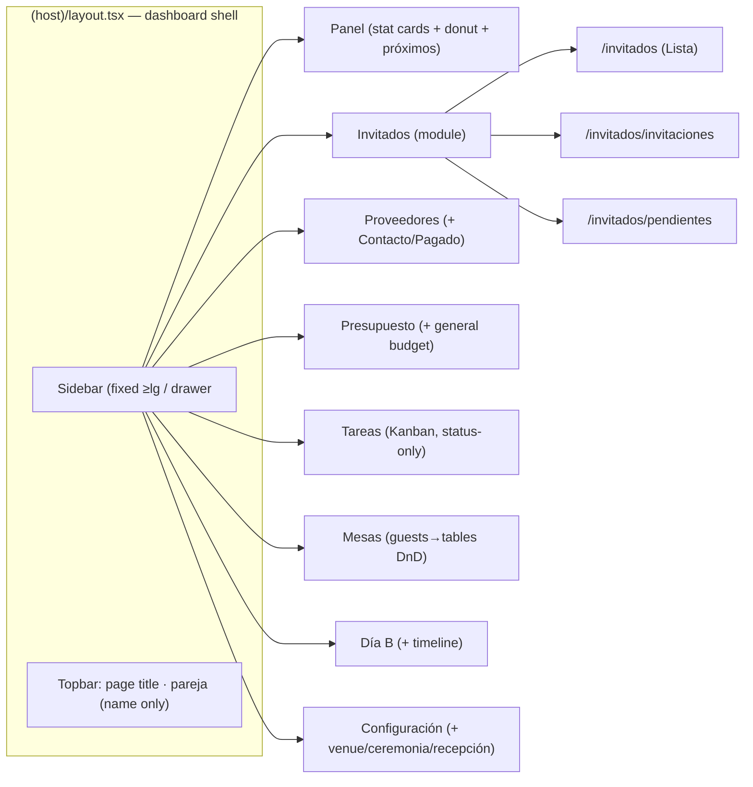

# feat: Back-office dashboard redesign + module upgrades

## Overview

A cross-cutting redesign of the boda-app back-office (`src/app/(host)`). It replaces the wrapping top nav with a modern **left sidebar dashboard shell**, **unifies Invitados + Invitaciones + Pendientes** into one tabbed module, converts **Tareas into a Kanban board** and **Mesas into a guests→tables drag-and-drop board** (both on `@dnd-kit`), adds a **general/overall budget** to Presupuesto, **merges the public invitation and info** onto one page, **removes the meal-selection ("menú") feature** end-to-end, and **aligns the app's forms/fields with the reference planner** in `docs/forms-context` (existing modules only — no new Honeymoon/Packing modules). The visual language is a practical, modern dashboard inspired by the Dashboard UI Kit reference, built by extending the existing Tailwind v4 tokens and hand-rolled primitives (no component library, no external assets).

Execution posture (confirmed): deliver as **one continuous effort**, U1→U12 in phase order (foundation → unification → module upgrades → merge → restyle).

## Problem Frame

The back-office works but reads as a set of separate "Fase 1/2/3" pages with a horizontal nav that **wraps** as links grow, three sibling top-level entries for guest management (Invitados/Invitaciones/Pendientes), a task list and a seating flow driven by dropdowns, and a per-category-only budget. The couple wants it to look and feel like a modern planning dashboard, to consolidate guest management, and to make tasks/seating direct-manipulation. They also want the app's forms to mirror the field taxonomy of a professional wedding-planner template (`docs/forms-context`, a 14-page "Professional Wedding Planner"). This is a UX/architecture upgrade over a healthy codebase — not a rewrite. The data model and Server-Action architecture stay; modules gain fields, new interaction surfaces, and a unified shell.

## Requirements Trace

Mapped from the user's requirements (Spanish) + the confirmed scoping answers.

- **R1 — Nav no-wrap:** back-office navigation items never wrap. → satisfied by the sidebar shell (U2).
- **R2 — Remove the "menú" feature (confirmed: everywhere):** remove the meal field from the back-office guest form/list **and** the guest-facing meal picker on the public RSVP; drop the `guests.menu` column. → U4.
- **R3 — Unify Invitados + Invitaciones + Pendientes** into one module for easy access. → U3.
- **R4 — General budget:** Presupuesto can manage an overall/general budget (envelope), not just per-category planned amounts. → U5.
- **R5 — Tareas as Kanban.** → U6a (schema/actions) + U6b (board).
- **R6 — Mesas as drag-and-drop:** guests on the left, tables on the right, seeing which guests sit around each table. → U7.
- **R7 — Invitation + info on one page**, info below the invitation. → U11.
- **R8 — Forms comply with `docs/forms-context`** (existing modules only; all four inferred field-sets confirmed by the user): Invitados (Address, remove Menú), Presupuesto (Estimado/Real/Pagado + totals), Proveedores (Vendor Type/Contact Person/Paid), Tareas (Task/Due/Completed/Notes — already aligned), Día B (Wedding Day Timeline: Hora/Evento/Notas), Configuración (Venue/Ceremony/Reception details). → U4, U5, U8, U9, U10.
- **R9 — Modern, practical dashboard UI** resembling the reference (sidebar, stat cards, donut, cards). → U1, U2, U12.

## Scope Boundaries

- **No authentication changes.** The app stays open; protection remains the Netlify Basic-Auth gate + `requireBackofficeAuth()` in every back-office action. This redesign adds new actions — each MUST gate.
- **No new top-level modules.** Per the scoping decision, Honeymoon Planner, Packing List, and the exhaustive Venue-Details checklist (parking/alcohol/restrooms/insurance/…) are **out of scope** as standalone modules.
- **No pixel-perfect clone** of the Dashboard UI Kit — it is a style reference for "modern and practical," not a spec. No external fonts, CDN scripts, remote images, or chart libraries (CSP is `default-src 'self'`); any chart/donut is inline SVG.
- **No generic SaaS chrome without a purpose.** The topbar's "global search" and "avatar" from the reference are **dropped** (no requirement, no data behind them); the topbar shows the page title + couple name only.
- **No dark mode** (single light theme stays).
- **Public "nuestra-boda" landing** (the untracked `src/app/(public)/nuestra-boda/` + `components/public/landing/*`) is **not** rewired here; the invitation+info merge targets the DB-backed `/i/[token]` page only.
- **No runtime DB migrations.** Every schema change is `pnpm db:generate` → commit migration → apply out-of-band (`pnpm db:migrate`) on deploy. Destructive drops use expand/contract sequencing (ship the code that stops referencing the column first, then drop).

### Deferred to Separate Tasks

- Full Venue-Details checklist (capacity, parking, accessibility, alcohol, rental fees, security/insurance, setup/cleanup, restrooms, restrictions) — a future Configuración expansion; U9 captures only the high-value subset (venue address/phone/coordinator, ceremony/reception times).
- Honeymoon Planner and Packing List modules — future work if desired.
- Wiring the `nuestra-boda` static landing to the DB / `submitRsvp` — separate effort. (Note: this guest-facing surface serves the app's external audience; if the wedding date is near, consider prioritizing it over back-office polish — raised in review, left as the couple's call.)
- Kanban in-column reorder for keyboard-only users (drag reorders; the accessible fallback moves between columns only) — revisit if needed.

## Context & Research

### Relevant Code and Patterns

- **Nav:** `src/components/host/host-nav.tsx` (flat `LINKS` array, `flex` with no overflow handling → wraps), `src/app/(host)/layout.tsx` (shell = `<HostNav/>` + children).
- **Page scaffold (all host pages):** `<main className="mx-auto w-full max-w-5xl px-4 py-12 sm:px-6">` + eyebrow/`h1`/description header. Restyle target.
- **Guests:** `src/app/(host)/invitados/page.tsx`, `src/components/host/guest-list.tsx`, `src/components/host/guest-form.tsx` (has the `Menú` field to remove, ~lines 93–95), `src/lib/actions/invitados.ts`. **Reads guests via full-column `select()`** (so a live bundle referencing a dropped column would 500 — see U4 sequencing).
- **Public RSVP / menú consumers (load-bearing for U4):** `src/lib/data/rsvp.ts` (`getRsvpView` selects `menu`, `applyRsvp` writes it), `src/components/public/rsvp-form.tsx` (guest picks meal), `src/lib/actions/rsvp.ts` (Zod validates `menu`), `src/components/public/privacy-notice.tsx` (documents it), `tests/e2e/public-rsvp.spec.ts` (covers "attendance + menu").
- **Invitations/Pendientes (unify):** `src/app/(host)/invitaciones/page.tsx`, `src/app/(host)/pendientes/page.tsx`, `src/components/host/invitation-manager.tsx`, `src/components/host/rsvp-reminders.tsx`, shared read `src/lib/data/invitations.ts` (`listInvitations`), mutations in `src/lib/actions/tokens.ts` (**these call `revalidatePath('/invitaciones')` — must be repointed in U3**).
- **Budget:** `src/app/(host)/presupuesto/page.tsx`, `src/components/host/budget-categories.tsx`, `src/components/host/payment-list.tsx` + `payment-form.tsx`, `src/lib/actions/presupuesto.ts` (money via `z.preprocess` + `parseMoneyToCents`).
- **Tasks:** `src/app/(host)/tareas/page.tsx` (`!t.done` filter/order/count), `src/components/host/task-list.tsx` (`useOptimistic` done-toggle — reference for optimistic board moves), `task-form.tsx`, `src/lib/actions/tareas.ts` (`createTask`/`toRow` return only `{title,dueDate,notes}`; `toggleTask` sets `{done}`). Dashboard `src/app/(host)/page.tsx` uses `!done`. **Día B does NOT read tasks/`done`** (verified).
- **Seating:** `src/app/(host)/mesas/page.tsx`, `src/components/host/seating-board.tsx` (Select-based assignment), `src/components/host/floor-plan.tsx` (hand-rolled Pointer-Events SVG **positioning** canvas — keep as-is; NOT a list-to-container DnD and NOT a drop-in fallback), `src/lib/data/seating.ts` (`assignGuestCore`, reuse), `src/lib/actions/mesas.ts`.
- **Public merge:** `src/app/(public)/i/[token]/page.tsx` (already loads `wedding` + token view), `src/components/public/invitation.tsx` (self-contained `<main>` + couple header + `PrivacyNotice`), `src/components/public/info-sections.tsx` (self-contained `<main>` + own header/notice — must be refactored to a fragment in U11).
- **Config / details:** `src/app/(host)/configuracion/page.tsx`, `src/components/host/config-form.tsx`, `src/lib/actions/configuracion.ts`; `wedding` singleton in `src/lib/db/schema.ts`.
- **Día B:** `src/app/(host)/dia-b/page.tsx` (read-only day-of view; timeline is net-new).
- **UI primitives (the "component library" to extend):** `src/components/ui/{button,card,dialog,field,input,label,select,textarea}.tsx`; `cn()` = `twMerge(clsx())`; `Dialog` wraps native `<dialog>`; `Field` clones its child and injects a11y ids; `Select` is a styled native `<select>`.
- **Tokens:** `src/app/globals.css` — Tailwind v4 CSS-first `@theme inline` (OKLCH warm palette; `--color-*`, `--radius-*`, `--shadow-*`; components consume via arbitrary values `bg-[var(--color-card)]`). No `tailwind.config.ts`.
- **Utils:** `src/lib/utils/{money,dates}.ts` (`formatCents` RD$; `isoDateDR`/`plusDaysDR`/`formatDateEs`, America/Santo_Domingo).
- **Testable-core split:** pure logic as `*Core(args, database = db)` in `lib/data/*`, thin `'use server'` wrappers in `lib/actions/*` add `requireBackofficeAuth()` + `revalidatePath()`. Unit tests inject PGlite via `makeTestDb()`.

### Institutional Learnings

- `docs/solutions/2026-06-23-pwa-serwist-turbopack-spike.md` — hand-rolled `public/sw.js` (Turbopack, not Serwist). **The SW must never cache RSC/prefetch/Server-Action responses** or it serves stale state after `revalidatePath`. Optimistic Kanban/seating still relies on `revalidatePath` staying trustworthy — do not extend SW caching to dynamic payloads.
- `docs/solutions/2026-06-23-fase0-security-headers.md` — CSP enforced in `next.config.ts`; `script-src`/`style-src` allow `'unsafe-inline'` but `img/font/connect/worker/manifest` are tight and `frame-ancestors 'none'`. **Any external font/CDN/image/fetch is blocked**; `@dnd-kit` is fine (bundled JS). `tests/e2e/security-headers.spec.ts` asserts the directives.
- `docs/deploy-netlify.md` — the edge gate is by **route**, but Server Actions dispatch by **action-ID**, so **every new back-office action MUST call `requireBackofficeAuth()`** or it's an unauthenticated write hole. `submitRsvp` is the only exemption. Guest data is treated as GDPR-relevant (EU region).
- `AGENTS.md` — "This is NOT the Next.js you know" (Next 16): read `node_modules/next/dist/docs/01-app/` before routing changes, avoid `'use cache'`, `redirect()` throws so call it **outside** try/catch; copy is Spanish `es-DO`; migrations generated/committed/applied out-of-band; real FKs own referential integrity.

### External References

- `@dnd-kit` (`@dnd-kit/core`, `@dnd-kit/sortable`, `@dnd-kit/modifiers`) — accessible pointer + keyboard + touch DnD; standard choice for Kanban + list-to-container assignment. **Compatibility must be verified at runtime, not just install:** the failure mode is "peer-deps OR hydration," and hydration issues surface during U6b/U7, after U1. If incompatible, the realistic fallback is Atlassian **Pragmatic drag-and-drop** (a from-scratch reimplementation, NOT an API-compatible swap) — the existing Pointer-Events floor-plan is SVG positioning with no drop-target/keyboard/reorder and is **not** a viable fallback for these boards.
- `docs/forms-context/Professional-Wedding-Planner-112577095/*.png` — field-taxonomy reference (fields, not layout): Guest List (Name/Address/Phone/RSVP/Notes + totals), Budget Tracker (Category/Estimated/Actual/Paid + Total Budget/Estimated/Actual), Vendor Contact (Type/Name/Contact Person/Phone/Email/Paid/Notes), Wedding Checklist (Task/Due/Completed/Notes), Wedding Day Timeline (Time/Event/Notes), Venue + Ceremony + Reception info.

## Key Technical Decisions

- **Left sidebar shell (confirmed).** Replace `HostNav` with a fixed left `Sidebar` (icon + label, `whitespace-nowrap` by construction) + a slim topbar (page title + couple name only — no search, no avatar). **Persistent sidebar at ≥ `lg` (1024px); off-canvas drawer below `lg`** (hamburger in topbar; close on route change / Escape / backdrop). No desktop icon-rail collapse in v1 (avoids an under-specified state).
- **Active-nav state:** exact-match for the Panel/root link (`/`), prefix-match for every other item (so `/invitados/*` highlights Invitados but Panel is not highlighted everywhere).
- **`@dnd-kit` for both boards (confirmed).** Add `@dnd-kit/core` + `@dnd-kit/sortable` (+ `@dnd-kit/modifiers` if needed). Each board uses `DndContext` with pointer + keyboard sensors, a **`DragOverlay` ghost** and **drop-target highlight** during drag, and reconciles state with **`useOptimistic` keyed to server props** (auto-revert on failure, auto-reconcile after `revalidatePath` — avoids the `useState` snapshot/stale-props pitfalls).
- **Every DnD board keeps an accessible non-drag fallback = a native `<select>` grouped by target** (Kanban: status; Mesas: table, reusing today's `Select` seat control). Drag is primary; the fallback is for keyboard users **and** is the path Playwright e2e asserts through (pointer-drag is unreliable in Playwright). Both paths call the same action (`moveTask` / `assignGuest`).
- **Drag itself gets real coverage:** a `@dnd-kit`-level component/unit test fires the sensor and asserts `onDragEnd` → correct `moveTask`/`assignGuest` call (not "best-effort"). The e2e fallback proves persistence; this proves the drag wiring.
- **Tasks: `status` is the SINGLE source of truth (no `done`/`status` dual-write).** Add `status` enum `('todo','doing','done')` (NOT NULL DEFAULT `'todo'`) + `position` integer; **drop the `done` column** and update its only consumers (`tareas/page.tsx`, dashboard `page.tsx`, `task-list`/`task-form`, `toggleTask`) to read/write `status`. This removes the desync bug class entirely. (Alternative considered: keep `done` as a Postgres generated column `GENERATED ALWAYS AS (status='done') STORED` — rejected for v1 to avoid PGlite test-support uncertainty; single-source is simpler.)
- **Menú removed end-to-end (confirmed).** Remove the back-office field AND the guest-facing meal picker; drop `guests.menu`. Because guests are read via full-column `select()` and the public RSVP writes `menu`, the drop is **destructive + expand/contract**: (1) ship the menu-free bundle (back-office + public RSVP + Zod) first, (2) then run the drop migration; take a pre-drop `pg_dump`/export of the column.
- **General budget lives on the `wedding` singleton** as `totalBudgetCents` (integer, default 0, `check >= 0`). Presupuesto surfaces: **Presupuesto general** (envelope), **Estimado/Previsto** (Σ category planned), **Real/Pagado** (Σ paid payments), **Restante** (general − pagado). This column ships in the **same single `wedding` migration** as U9's venue/ceremony/reception fields (see below).
- **One combined `wedding` migration for U5 + U9 (hard dependency).** Both alter the `wedding` singleton; generating two migrations on divergent work risks a corrupted Drizzle journal/snapshot. Generate `totalBudgetCents` + venue/ceremony/reception fields together, in one migration.
- **Vendors: keep `category` free-text, add `contactPerson` + `paid` (confirmed).** Surface the reference Vendor-Type list (Venue/Caterer/Photographer/Florist/Hair&Makeup/Transportation/Officiant/Cake) as UI presets (datalist/select-with-"Otro"). `paid` is a **manual override** independent of the payment ledger (the couple confirmed they want the simple checkbox); document that a vendor's true spend still lives in `payments` and `paid` is a quick at-a-glance flag, not the source of truth for money math.
- **Guests: drop `menu`, add `address` (optional, confirmed).** `address` is host-only PII, hidden when empty, subject to the same GDPR/minimization posture as existing guest PII (`docs/deploy-netlify.md`): never surfaced on any public page, discarded/exportable under the same retention rules. Dietary/allergies remains intentionally omitted (standing no-allergies decision).
- **Día B timeline (confirmed) is a simple time-sorted list.** A small `timelineEvents` table (`time`, `event`, `notes`) with back-office CRUD, **ordered by `time` (no manual `position`/reorder column)** — matching the "high-value subset" discipline applied to Venue-Details. Día B renders it read-only alongside mesas/contactos.
- **Invitados unification via nested routes** under `/invitados` with a shared tabbed layout (`Lista` / `Invitaciones` / `Pendientes`); old `/invitaciones` and `/pendientes` paths redirect via **`next.config` permanent redirects (308)** to the new sub-routes. One sidebar entry.
- **New PII on the shared `wedding` object is host-only.** U9 adds `venue_phone`/`venue_coordinator` (third-party personal contacts) to the `wedding` singleton while U11 widens what of `wedding` renders publicly. These new fields must **never** be passed into `Invitation`/`InfoSections`; U11 renders only the pre-existing public `/info` fields.
- **Restyle by extending tokens + primitives centrally** (`globals.css` + `components/ui/*`), preserving the `[var(--…)]` arbitrary-value convention; no shadcn/Radix, no external assets. New primitives are added **only when a unit consumes them** (no speculative Badge/Avatar).

## Open Questions

### Resolved During Planning

- Navigation layout → **left sidebar**; persistent ≥lg, drawer below; no icon-rail collapse in v1.
- DnD approach → **`@dnd-kit`** for Kanban + seating, with `useOptimistic` reconciliation + native-`<select>` accessible fallback + a component-level drag test.
- Forms-context scope → **align existing modules only**; all four inferred field-sets (Address, vendor Contact/Paid, venue/ceremony/reception, Día B timeline) **confirmed by the user**.
- "Quita eso del menú" → **remove the menú feature everywhere** (back-office + public RSVP) and drop `guests.menu` (destructive, expand/contract, with backup).
- Dietary Restrictions (guest form) → **omit** (conflicts with the standing no-allergies decision).
- Tasks Kanban model → **`status` single source of truth; drop `done`**; `status` NOT NULL DEFAULT `'todo'`; `createTask` sets `status`+`position`.
- General budget storage → `totalBudgetCents` on the `wedding` singleton, in a **combined migration with U9**.
- Topbar chrome → **drop** global search + avatar (page title + couple name only).
- Execution → **full plan, U1→U12 in phase order.**

### Deferred to Implementation

- **`@dnd-kit` React 19 / Next 16 compatibility** — confirm with a **runtime `DndContext` smoke render** in U1 (not just `pnpm install`); if hydration misbehaves, budget a Pragmatic-DnD reimplementation (not a drop-in swap).
- **Exact Kanban column labels** — Spanish (e.g. "Por hacer / En curso / Hecho"); confirm wording during build.
- **Fate of standalone `/info`** — default to a redirect to the merged `/i/[token]`… but note the token is per-invitation, so `/info` (which has no token) more likely becomes a small standalone page or is removed; decide in U11. The `invitation.tsx` footer "ver info" link becomes an in-page anchor to the merged info section.
- **Seating "around the table" visual** — default: guest chips arranged around a round/rect CSS motif (not a flat list); refine in U7.
- **Kanban `position` reindex strategy** (gap vs. full reindex) and behavior under near-concurrent moves — decide in U6a; cover in `moveTaskCore` tests.
- Precise helper/query/method names, migration SQL, and final Tailwind class sets — emerge in code.

## High-Level Technical Design

> *This illustrates the intended approach and is directional guidance for review, not implementation specification. The implementing agent should treat it as context, not code to reproduce.*

### New back-office shell + module map



### DnD interaction contract (Kanban + seating share this shape)

```
drag start → dnd-kit sensor (pointer OR keyboard)
  DURING drag: DragOverlay ghost follows cursor; hovered drop-target
               (column / table) highlights; over-capacity table previews
               its warning state before release
  onDragEnd(active, over):
    useOptimistic update keyed to server props (list/column membership + order)
    call Server Action (moveTask / assignGuest)   // 'use server' → requireBackofficeAuth → validate → mutate → revalidatePath
    on !ok → optimistic auto-reverts (transition ends) + window.alert(error)
    on ok  → revalidatePath returns fresh props; useOptimistic reconciles
accessible fallback: each item also has a native <select> (group by target)
                     calling the SAME action — this is the e2e-asserted path
drag coverage: a dnd-kit component test fires the sensor and asserts
               onDragEnd → correct action call
```

### Schema changes (migrations: generate → commit → out-of-band apply; drops use expand/contract)

| Table | Change | Purpose |
|---|---|---|
| `guests` | **drop `menu`** (expand/contract + backup); add `address text` (nullable) | R2, R8 (Guest List form) |
| `vendors` | add `contact_person text`, `paid boolean default false` | R8 (Vendor Contact form) |
| `wedding` (**one combined migration**) | add `total_budget_cents integer default 0 check >= 0`; add `venue_address`, `venue_phone`, `venue_coordinator`, `ceremony_start`, `ceremony_end`, `reception_start`, `reception_end` (text, nullable) | R4 (U5) + R8 (U9) |
| `tasks` | add `status text enum('todo','doing','done') NOT NULL DEFAULT 'todo'` + `check`, `position integer`; backfill `status` from `done`; **then drop `done`** (expand/contract) | R5 (Kanban) |
| `timeline_events` (new) | `id`, `time text`, `event text`, `notes text`, timestamps (**no `position`**; order by `time`) | R8 (Wedding Day Timeline / Día B) |

### Forms-context → module alignment

| Reference form | Module | Field action |
|---|---|---|
| Guest List | Invitados | remove **Menú** (everywhere); add **Address** (optional, host-only); RSVP + counts already present; omit Dietary |
| Budget Tracker | Presupuesto | add **Presupuesto general**; label Estimado(previsto)/Real(pagado)/Restante; totals row |
| Vendor Contact | Proveedores | add **Contact Person**, **Paid** (manual flag); Vendor-Type presets on `category` |
| Wedding Checklist | Tareas | already Task/Due/Completed/Notes — Kanban preserves; "Completed" = `status='done'` |
| Wedding Day Timeline | Día B | new editable **timeline** (Hora/Evento/Notas), time-sorted |
| Venue + Ceremony + Reception | Configuración | add venue address/phone/coordinator + ceremony/reception times (subset; host-only) |

## Implementation Units

Delivered as one continuous effort in phase order. Phases 1→2 are foundational; module units follow.

### Phase 1 — Foundation (design system + shell)

- [x] **U1: Design tokens, dashboard primitives, and `@dnd-kit` (with runtime smoke test)**

**Goal:** Establish the modern-dashboard visual layer and prove `@dnd-kit` works at runtime before later units depend on it.

**Requirements:** R9 (+ enables R5, R6).

**Dependencies:** None.

**Files:**
- Modify: `src/app/globals.css` (extend `@theme inline` — sidebar surface token, elevated-card shadow; keep the warm OKLCH palette)
- Create: `src/components/ui/donut.tsx` (inline-SVG progress ring), `src/components/ui/stat-card.tsx`, `src/components/ui/tabs.tsx` (consumed by U3)
- Modify: `src/components/ui/card.tsx` (elevation/variant if needed)
- Modify: `package.json` (add `@dnd-kit/core`, `@dnd-kit/sortable`, optionally `@dnd-kit/modifiers`)
- Create (temporary): a scratch route or test that mounts a real `DndContext` board to smoke-test hydration under Next 16 / React 19

**Approach:**
- Extend, don't replace, tokens; preserve the `[var(--…)]` convention; hand-rolled primitives via `cn()`; no external UI lib.
- `Donut` is pure inline SVG (CSP blocks external chart libs); `value`/`max`/label.
- **Do NOT build Badge or Avatar here** — add a primitive only when a unit consumes it (no speculative generality).
- Verify `@dnd-kit` at runtime: mount a `DndContext` + draggable/droppable and confirm no hydration mismatch/console error (not just that install resolves). Record resolved versions. If it misbehaves, stop and escalate the Pragmatic-DnD fallback before U6b/U7.

**Patterns to follow:** existing `src/components/ui/*` (variants via `cn()`, `Field` a11y model), token usage in `globals.css`.

**Test scenarios:**
- Happy path (unit): `Donut` renders the correct filled proportion (3/5 → ~60% arc); 0/0 → empty, no divide-by-zero.
- Runtime (smoke): a mounted `DndContext` hydrates without error under the app's Next 16 / React 19 setup.
- Test expectation: `StatCard`/`Tabs` are presentational; covered indirectly by module e2e.

**Verification:** `pnpm typecheck` passes; `@dnd-kit` hydrates cleanly (smoke test green); no new external network requests (CSP intact).

- [x] **U2: Left sidebar app shell**

**Goal:** Replace the wrapping top nav with a fixed left sidebar (≥lg) + mobile drawer (<lg) + slim topbar; nav items no-wrap (R1).

**Requirements:** R1, R9.

**Dependencies:** U1.

**Files:**
- Create: `src/components/host/sidebar.tsx` (client — active-link state, mobile drawer), `src/components/host/topbar.tsx`, optionally `src/components/host/shell.tsx`
- Modify: `src/app/(host)/layout.tsx` (compose Sidebar + Topbar + content container)
- Remove/replace: `src/components/host/host-nav.tsx`
- Modify: host page scaffolds to drop their own `max-w-5xl` centering where the shell now owns width (finished in U12)

**Approach:**
- Sidebar `NAV` (post-unification): Panel, Invitados, Proveedores, Presupuesto, Tareas, Mesas, Día B, Configuración — icon + `whitespace-nowrap` label.
- **Active state:** Panel (`/`) exact-match; all other items prefix-match via `usePathname` (so `/invitados/pendientes` highlights Invitados, and Panel is not highlighted everywhere).
- **Breakpoint:** persistent sidebar at ≥`lg` (1024px); off-canvas drawer below (hamburger in topbar; close on route change / Escape / backdrop). Respect `prefers-reduced-motion`.
- **Topbar:** page title + couple name only — no search, no avatar. Inline SVG icons only (no external icon set).

**Test scenarios:**
- Happy path (e2e): each sidebar link navigates to its module; the active module is marked (`aria-current="page"`); Panel is active only on `/`.
- Behavior (e2e): below `lg`, the drawer opens via the hamburger and closes on link click / Escape / backdrop.
- Edge case (e2e): nav items never wrap; deep route `/invitados/pendientes` marks "Invitados" active while Panel is not.
- Accessibility: sidebar is a labeled `nav` landmark; drawer toggle has an accessible name + `aria-expanded`.

**Verification:** all pages render inside the new shell; no nav wrap at any width; `host-dashboard.spec.ts` updated/green.

### Phase 2 — Invitados unification

- [x] **U3: Unify Invitados + Invitaciones + Pendientes into one tabbed module**

**Goal:** One module home with sub-tabs Lista / Invitaciones / Pendientes (R3), one sidebar entry.

**Requirements:** R3, R8 (consolidation).

**Dependencies:** U2.

**Files:**
- Create: `src/app/(host)/invitados/layout.tsx` (tabbed sub-nav via `Tabs`)
- Move: `invitaciones/page.tsx` → `invitados/invitaciones/page.tsx`; `pendientes/page.tsx` → `invitados/pendientes/page.tsx`
- Keep: `invitados/page.tsx` (Lista tab)
- Modify: `next.config.ts` — **permanent (308) redirects** `/invitaciones` → `/invitados/invitaciones`, `/pendientes` → `/invitados/pendientes`
- **Modify (revalidation targets): `src/lib/actions/tokens.ts`** — its create/revoke/regenerate actions call `revalidatePath('/invitaciones')`; repoint to `/invitados/invitaciones`. **Audit `src/lib/actions/rsvp.ts` and `configuracion.ts`** for path-coupled `revalidatePath` that the route move affects.
- Modify: cross-links (`pendientes` → "Crea una invitación") to new paths
- Modify tests: `tests/e2e/host-invitados.spec.ts`, `host-pendientes.spec.ts`, invitaciones spec

**Approach:**
- The three pages already share `listInvitations`; keep their data loads. `layout.tsx` renders `Tabs` with active state from `usePathname`. Preserve query params on the Lista tab (search/status chips).
- Use `next.config` redirects (308, matches "permanent") rather than in-page `redirect()` (which returns 307).

**Test scenarios:**
- Happy path (e2e): `/invitados` shows Lista with tabs; Invitaciones/Pendientes tabs load; correct tab active.
- Revalidation (e2e): creating an invitation refreshes the Invitaciones tab **without a hard reload** (proves `tokens.ts` revalidates the new path).
- Redirect (e2e): old `/invitaciones` and `/pendientes` return 308 to the new sub-routes.
- Regression (e2e): guest search + status chips still work on Lista; cross-link points to `/invitados/invitaciones`.

**Verification:** one sidebar entry; old links 308-redirect; invitation create/revoke refreshes the live tab; module e2e green.

### Phase 3 — Invitados fields (remove menú, add address)

- [x] **U4: Remove the menú feature end-to-end; add guest Address**

**Goal:** Remove meal selection from the back-office AND the public RSVP, drop `guests.menu` safely (R2), and add optional `address` (R8).

**Requirements:** R2, R8.

**Dependencies:** U3 (same module; can also land independently).

**Files:**
- Modify (back-office): `src/components/host/guest-form.tsx` (remove Menú `Field`; add `Dirección`), `src/components/host/guest-list.tsx` (drop menu display; show address optionally), `src/lib/actions/invitados.ts` (Zod: remove `menu`, add optional `address`)
- Modify (public RSVP — the load-bearing consumers): `src/components/public/rsvp-form.tsx` (remove meal picker), `src/lib/data/rsvp.ts` (`getRsvpView` select + `applyRsvp` write), `src/lib/actions/rsvp.ts` (remove `menu` from Zod), `src/components/public/privacy-notice.tsx` (drop the menu mention)
- Modify: `src/lib/db/schema.ts` (add `address`; drop `menu`) → **two migrations**: (M1) add `address`; (M2) drop `menu` (run after the menu-free bundle is live)
- Modify tests: `tests/e2e/public-rsvp.spec.ts` (remove "attendance + menu" menu assertions), `tests/e2e/host-invitados.spec.ts`

**Approach (expand/contract, destructive):**
1. **Backup:** export `guests.menu` (`pg_dump`/`COPY`) before dropping — the drop is irreversible.
2. Ship the **menu-free bundle** (all back-office + public RSVP + Zod edits, plus M1 adding `address`). Because guests are read via full-column `select()`, the live code must stop referencing `menu` before the column is dropped.
3. Only after that deploy is live, run **M2 (DROP COLUMN `menu`)**.
- `address` is optional, `null` when empty, host-only (never rendered publicly), same GDPR/retention posture as existing guest PII.

**Execution note:** sequence M2 (drop) strictly after the menu-free bundle is live; never generate a drop that the current bundle's `select()` would hit.

**Test scenarios:**
- Happy path (e2e): back-office guest form has no Menú field but has Dirección; creating a guest with an address persists/displays.
- Public RSVP (e2e): the invitation RSVP form no longer shows a meal picker; submitting attendance still works and no longer writes/reads `menu`.
- Validation (unit): address over max length → Spanish field error; empty address → `null`.
- Migration safety (unit/manual): M1 adds `address` (null default) on populated data; M2 drops `menu` only after code is menu-free; a pre-drop export exists.
- Regression (e2e): guest CRUD + RSVP status + invalid-token path intact; `rg "menu" src/` returns no guest/RSVP references before M2 runs.

**Verification:** no menú anywhere (host + public); RSVP submit works without it; `address` works; drop is backed up and correctly sequenced.

### Phase 4 — Presupuesto general budget (shares the wedding migration with U9)

- [x] **U5: General/overall budget + label alignment**

**Goal:** Manage a general budget envelope alongside per-category planned amounts; align the summary to the reference (R4, R8).

**Requirements:** R4, R8.

**Dependencies:** U1. **Migration coupled with U9** (one combined `wedding` migration).

**Files:**
- Modify: `src/lib/db/schema.ts` (`wedding.totalBudgetCents integer default 0`, `check >= 0`) — generated **together with U9's fields in one migration**
- Modify: `src/lib/actions/configuracion.ts` **or** `presupuesto.ts` (gated action to set the general budget; `requireBackofficeAuth()` + money `z.preprocess`)
- Modify: `src/app/(host)/presupuesto/page.tsx` (load `totalBudgetCents`; Restante = general − pagado; edit control) + a small `general-budget` editor component
- Modify: `src/app/(host)/page.tsx` dashboard (use general budget in "Presupuesto restante" when set)
- Modify tests: `tests/e2e/host-presupuesto.spec.ts`

**Approach:** reuse `parseMoneyToCents`/`formatCents`. Show **General**, **Estimado (previsto)**, **Pagado (real)**, **Restante** (general − pagado; danger when negative). Editing is a small inline gated form.

**Test scenarios:**
- Happy path (e2e): set a general budget → Restante = general − paid updates; clearing falls back to the previsto-based view.
- Edge case (unit): paid > general → danger style; 0/unset → "no envelope set".
- Validation (unit): non-numeric/negative rejected with a Spanish error; money parsing handles `RD$`/separators.
- **Auth (unit): the general-budget setter rejects when `requireBackofficeAuth()` fails** (parity with `moveTask`/timeline auth tests).
- Regression (e2e): category planned + payment CRUD still work; dashboard reflects the general budget when set.

**Verification:** general budget persists; Presupuesto + dashboard reflect it; money math correct in cents; action is auth-gated and tested.

### Phase 5 — Tareas Kanban

- [x] **U6a: Tasks schema + actions for Kanban (status as single source of truth)**

**Goal:** Add board state and make `status` authoritative (drop `done`), with move/reorder actions.

**Requirements:** R5.

**Dependencies:** None (schema); precedes U6b.

**Files:**
- Modify: `src/lib/db/schema.ts` (`tasks.status` enum NOT NULL DEFAULT `'todo'` + `check`; `tasks.position integer`) → migration adds columns + **hand-edited backfill** (`status='done'` WHERE `done=true`; seed `position` per current read order); a follow-up migration drops `done` after code no longer reads it (expand/contract)
- Create: `src/lib/data/tasks.ts` (`moveTaskCore(id, status, position, database = db)` — pure, testable)
- Modify: `src/lib/actions/tareas.ts` (`createTask`/`toRow` set `status:'todo'` + `position = max(position)+1`; add `moveTask`/`reorderTask` with `requireBackofficeAuth()`; convert `toggleTask` to set `status` `'done'`↔`'todo'`)
- Modify consumers of `done`: `src/app/(host)/tareas/page.tsx` (`!done` → `status !== 'done'`), `src/app/(host)/page.tsx` dashboard (`pendingTasks = status !== 'done'`), `task-list.tsx`/`task-form.tsx`

**Approach:**
- **`status` is the only state.** No `done` column after expand/contract, so there is no dual-write to desync. Día B is unaffected (it never read `done`).
- `drizzle-kit` emits DDL only — **hand-edit the generated migration** to add the backfill `UPDATE`s and column defaults so `ADD COLUMN` succeeds on existing rows.
- `position` reindex strategy (gap vs. reindex) decided in code; cover with tests.

**Execution note:** implement `moveTaskCore` test-first against `makeTestDb()` (PGlite); sequence the `done` drop after the status-only bundle is live.

**Test scenarios:**
- Happy path (unit): `createTask` → `status='todo'`, `position` = next; `moveTask` to `'done'` sets status and lands the card in the Hecho column.
- Ordering (unit): moves within/between columns yield a consistent order; sequential moves don't collide.
- Backfill (unit): pre-existing `done=true` rows map to `'done'`, others to `'todo'`; `position` seeded deterministically; dropping `done` afterward leaves reads working (they use `status`).
- Auth (unit): `moveTask`/`reorderTask` reject when `requireBackofficeAuth()` fails.

**Verification:** `status` drives every consumer; no `done` references remain after the drop; unit suite green.

- [x] **U6b: Kanban board UI (`@dnd-kit`)**

**Goal:** Replace the flat list with a 3-column Kanban: drag between columns + reorder, optimistic, accessible fallback (R5).

**Requirements:** R5, R9.

**Dependencies:** U1 (@dnd-kit), U6a.

**Files:**
- Create: `src/components/host/task-board.tsx` (client — columns, `DndContext`+`SortableContext`, `DragOverlay`, `useOptimistic`, native-`<select>` fallback), `task-card.tsx`
- Modify: `src/app/(host)/tareas/page.tsx` (group by `status`, order by `position`; render board), keep `task-form.tsx` dialog
- Remove: `src/components/host/task-list.tsx` (replaced — decide-and-remove, not "optional", to avoid two competing views)
- Create: a `@dnd-kit` component test for drag wiring
- Modify tests: `tests/e2e/host-tareas.spec.ts`

**Approach:**
- Columns "Por hacer / En curso / Hecho" (wording TBD). Card shows title + due tag (`formatDateEs`, overdue/soon colors). Pointer + keyboard sensors; `DragOverlay` ghost; drop-target column highlight during drag. `onDragEnd` → `useOptimistic` move → `moveTask` → auto-revert + alert on failure; reconcile after `revalidatePath`.
- **Accessible fallback:** each card has a native `<select>` (group = status) invoking `moveTask` — the e2e path. Keyboard reorder within a column is not covered by the fallback (drag only) — noted in Scope Boundaries.
- **Empty state:** each column always renders a full-height droppable placeholder (so a drag can land in an empty column); an all-empty board shows a "Nueva tarea" affordance.
- Respect `prefers-reduced-motion` (disable drag animation).

**Test scenarios:**
- Happy path (e2e via fallback): create task (→ "Por hacer"); select → "Hecho" moves it and it shows completed on the dashboard.
- Drag (component test): firing the sensor with a target column calls `moveTask` with the right `status`; dropping into an empty column lands there.
- Optimistic (e2e): a move shows instantly and survives reload; a forced failure reverts + alerts.
- Regression (e2e): task create/edit/delete dialog works; due tags (Vencida/Próxima) render.

**Verification:** board reflects `status`/`position`; drag wiring covered by a component test; fallback works headlessly; dashboard/tareas consume `status`.

### Phase 6 — Mesas drag-and-drop

- [x] **U7: Seating board — guests→tables drag-and-drop**

**Goal:** Two-pane DnD: unseated guests (left) dragged onto table drop-zones (right) that show who sits around each table (R6).

**Requirements:** R6, R9.

**Dependencies:** U1 (@dnd-kit).

**Files:**
- Modify: `src/components/host/seating-board.tsx` → DnD board (left: draggable guest chips by RSVP; right: droppable table cards showing seated guests **around a round/rect motif** + occupancy/over-capacity). Keep table create/edit/delete dialog.
- Keep: `src/components/host/floor-plan.tsx` (SVG positioning canvas) as a secondary "Plano" view.
- Modify: `src/app/(host)/mesas/page.tsx` (board + optional plano), reuse `assignGuest`
- Create: a `@dnd-kit` component test for the seating drag wiring
- Modify tests: `tests/e2e/host-mesas.spec.ts` (seat-`combobox` assertions move to the retained `<select>` fallback), keep `host-plano.spec.ts`

**Approach:**
- Left: unseated attending guests (declined excluded) + count; drag a chip onto a table → `useOptimistic` seat → `assignGuest` → revert + alert on failure. Dragging a seated guest to "Sin sentar" unseats (tableId → null).
- Right: each table is a droppable card rendering seated guests **around** a round/rect shape; occupancy `used/capacity`; **over-capacity previews its warning while a chip is dragged over** (soft, never blocks — preserve current rule).
- **Accessible fallback:** retain the per-guest `<select>` ("Sentar en…") calling `assignGuest` — the e2e path.
- Preserve data-integrity rules: `guests.tableId` `set null` on table delete; capacity soft; moving a table's x/y never touches assignments.

**Test scenarios:**
- Happy path (e2e via fallback): assign a guest to a table via the select → guest appears around that table, leaves the unseated list; occupancy increments.
- Drag (component test): dropping a guest chip on a table calls `assignGuest(guestId, tableId)`; dropping on "Sin sentar" calls `assignGuest(guestId, null)`.
- Capacity (e2e): seating beyond capacity shows the warning but still allows it (soft).
- Concurrency/stale (unit, extend `seating.test.ts`): assigning to a since-deleted table id → "Mesa no encontrada"; declined guests don't count toward occupancy.
- Regression (e2e): table CRUD works; deleting a table unseats its guests (FK set null); the Plano canvas drag still persists positions.

**Verification:** DnD + fallback both call `assignGuest`; tables show their guests; capacity/occupancy correct; `host-mesas` + `host-plano` e2e updated/green.

### Phase 7 — Proveedores, Config, Día B, public merge, restyle

- [x] **U8: Proveedores alignment (Vendor Type / Contact Person / Paid)**

**Goal:** Align vendor fields with the reference Vendor-Contact form (R8).

**Requirements:** R8.

**Dependencies:** U1.

**Files:**
- Modify: `src/lib/db/schema.ts` (`vendors.contact_person text`, `vendors.paid boolean default false`) + migration
- Modify: `src/components/host/vendor-form.tsx` (add Contact Person + Paid; Vendor-Type presets on `category` via datalist/select-with-"Otro"), `vendor-list.tsx` (show contact/paid), `src/lib/actions/proveedores.ts` (Zod additions)
- Modify tests: `tests/e2e/host-proveedores.spec.ts`

**Approach:** keep the existing deal `status` pipeline; `paid` is a **manual at-a-glance flag**, independent of the `payments` ledger (documented so no one treats it as the money source of truth). Category stays free-text with reference presets.

**Test scenarios:**
- Happy path (e2e): create a vendor with a Type preset, Contact Person, Paid checked → all persist/display.
- Edge case (unit): custom ("Otro") category accepted; Paid defaults false; Contact Person optional → `null`.
- Regression (e2e): vendor status pipeline + amount/contract-URL work; Día B "Contactos" still lists vendors with a phone.

**Verification:** vendor CRUD covers new fields; migration applies; Día B contacts unaffected.

- [x] **U9: Configuración — venue/ceremony/reception details (host-only)**

**Goal:** Extend the wedding config with the high-value venue/ceremony/reception subset (R8).

**Requirements:** R8.

**Dependencies:** **Combined `wedding` migration with U5** (generate `totalBudgetCents` + these fields in one migration; do not generate two `wedding` migrations).

**Files:**
- Modify: `src/lib/db/schema.ts` (`wedding`: `venue_address`, `venue_phone`, `venue_coordinator`, `ceremony_start`, `ceremony_end`, `reception_start`, `reception_end` — text nullable) — in the combined migration
- Modify: `src/components/host/config-form.tsx` (new fieldset "Lugar y ceremonia"), `src/lib/actions/configuracion.ts` (Zod additions)

**Approach:** new `fieldset` following the existing config-form structure; all optional, hidden-when-empty. Times are free-text (like `eventTime`). **These fields are host-only PII (venue_phone/coordinator are third-party contacts) — never passed to `Invitation`/`InfoSections`** (enforced in U11).

**Test scenarios:**
- Happy path (e2e/manual): fill venue address/phone/coordinator + ceremony/reception times → persist/re-render.
- Edge case (unit): all optional → empty saves as `null`; over-length → Spanish errors.
- **Boundary (test): the new venue fields never appear in the public `/i/[token]` rendered output.**
- Regression: existing config fields still save; `/info` rendering unchanged.

**Verification:** config saves new fields; no public leakage of host-only venue PII.

- [x] **U10: Día B — editable Wedding Day Timeline (time-sorted)**

**Goal:** Add a simple editable timeline (Hora/Evento/Notas), ordered by time (R8).

**Requirements:** R8.

**Dependencies:** U1.

**Files:**
- Modify: `src/lib/db/schema.ts` (new `timeline_events`: `id`, `time text`, `event text`, `notes text`, timestamps — **no `position`**) + migration
- Create: `src/lib/data/timeline.ts` (`*Core` CRUD, order by `time`), `src/lib/actions/timeline.ts` (gated wrappers), `src/components/host/timeline-editor.tsx`
- Modify: `src/app/(host)/dia-b/page.tsx` (render timeline read-only alongside mesas/contactos; editor behind a small "Editar cronograma" affordance, keeping the read-only day-of view intact for offline)
- Modify tests: `tests/e2e/host-dia-b.spec.ts`

**Approach:** entries ordered by `time` (string compare works for zero-padded times; document the expected `HH:MM` input). Editor uses the canonical form/dialog + optimistic list. Keep the day-of read-only render cache-friendly (SW NetworkFirst; no PII beyond names already shown).

**Test scenarios:**
- Happy path (e2e): add "17:00 · Ceremonia" → appears time-sorted on Día B.
- Edge (unit): entries sort by `time`; empty notes allowed; two same-time entries render deterministically.
- Auth (unit): timeline mutations require `requireBackofficeAuth()`.
- Regression: Día B mesas/contactos read-only + offline still work.

**Verification:** timeline CRUD works, time-sorted; Día B renders it; offline snapshot unaffected.

- [x] **U11: Merge public invitation + info onto one page**

**Goal:** Render info sections below the invitation on `/i/[token]` without duplicated landmarks (R7).

**Requirements:** R7.

**Dependencies:** None (but must respect U9's host-only boundary).

**Files:**
- **Refactor: `src/components/public/info-sections.tsx`** into a **section fragment** — no own `<main>`, no repeated couple-name header, no its own `PrivacyNotice`
- Modify: `src/app/(public)/i/[token]/page.tsx` and/or `src/components/public/invitation.tsx` (compose the InfoSections fragment inside `Invitation`'s single `<main>`, below the RSVP, with **one** shared footer/`PrivacyNotice`)
- Modify: `src/app/(public)/info/page.tsx` (renders the same fragment inside its own `<main>` for the tokenless `/info` route) + the `invitation.tsx` footer "ver info" link → in-page anchor to the merged section
- Modify tests: `tests/e2e/public-invitation.spec.ts`, `tests/e2e/public-info.spec.ts`

**Approach:**
- Extract the info content into a reusable fragment consumed by both the merged invitation page and the standalone `/info` page (avoids two `<main>`/header/notice on the merged page). Preserve `noindex` (gift/IBAN hygiene) and the token/`Referrer-Policy` posture.
- **Render only the pre-existing public `/info` fields** (map, schedule, dress code, accommodation, transport, gift). **Do NOT render** the new host-only venue fields from U9 (`venue_phone`, `venue_coordinator`, etc.).

**Test scenarios:**
- Happy path (e2e): a valid token page shows the invitation then the info sections below, with exactly one `<main>`, one couple-name header, one privacy notice; empty info sections stay hidden.
- Boundary (e2e): U9's `venue_phone`/`venue_coordinator` never appear on the public page.
- Regression (e2e): invalid/expired token → `InvitationInvalid`; RSVP submit works; `/info` still renders standalone.
- Privacy: merged page remains `noindex, nofollow`.

**Verification:** one clean merged page (no duplicated landmarks); host-only PII not leaked; RSVP + invalid-token intact.

- [x] **U12: Global restyle pass + Panel donut + verification**

**Goal:** Apply the dashboard look consistently, add a donut to the Panel, verify guardrails (R9).

**Requirements:** R9.

**Dependencies:** U1, U2 (lands after module units so their markup is final).

**Files:**
- Modify: `src/app/(host)/page.tsx` (Panel — `StatCard` grid; **one `Donut` showing a single chosen metric = RSVP confirmados %**; keep próximos pagos/tareas), and remaining host pages for consistent headers/containers/empty states; drop stale "Fase 1/2/3" eyebrows
- Modify: `src/app/globals.css` only if token tweaks surface
- Verify: `next.config.ts` CSP unchanged (no external assets); `tests/e2e/security-headers.spec.ts` green

**Approach:** consistency pass (spacing, cards, tables, chips, buttons); `prefers-reduced-motion` respected; no external font/CDN/image; Spanish copy throughout. The Panel donut is a single metric (confirmados %), matching `Donut`'s single-`value`/`max` contract.

**Test scenarios:**
- Happy path (e2e): Panel shows stat cards + a single confirmados-% donut reflecting real counts; all modules share the shell/visual language.
- Guardrail (e2e): `security-headers.spec.ts` passes; no console CSP violations.
- Accessibility: AA text contrast on new surfaces; focus rings present.

**Verification:** cohesive dashboard look; CSP/headers e2e green; no external network requests.

## System-Wide Impact

- **Interaction graph:** new Server Actions (`moveTask`/`reorderTask`, general-budget setter, vendor fields, timeline CRUD) all funnel through `requireBackofficeAuth()` + `revalidatePath`. Consider a repo-wide **static test asserting every exported function in `src/lib/actions/*` calls `requireBackofficeAuth()`** before a DB write (except `submitRsvp`) so no future unit ships ungated. Optimistic boards depend on `revalidatePath` correctness — the SW must keep NOT caching RSC/Server-Action responses.
- **Error propagation:** direct mutations return `{ ok:false, error }` via `window.alert`; form mutations return `{ fieldErrors }` via `Field`. DnD failures auto-revert (`useOptimistic`).
- **State lifecycle risks:** tasks use a **single `status` source of truth** (no `done` dual-write). `guests.tableId` `set null` on table delete preserved. **Two destructive drops** (`guests.menu`, `tasks.done`) each require expand/contract sequencing + (for menu) a backup.
- **API surface parity:** seating and tasks each have two entry points (drag + `<select>` fallback) that MUST call the same action identically.
- **Integration coverage (prove with e2e/`*Core`/component tests):** "move task to Hecho → dashboard shows it done"; "seat guest → Día B read-only view reflects it"; "set general budget → dashboard Restante updates"; "create invitation → Invitaciones tab refreshes"; "old `/invitaciones` → 308"; "drag → correct action call".
- **`done`-consumer set (corrected):** only `tareas/page.tsx` + dashboard `page.tsx` (+ `task-list`/`task-form`/`toggleTask`). **Día B does NOT read `done`** — it is unaffected by the tasks change.
- **Unchanged invariants:** open-app/no-auth posture; Basic-Auth gate + `requireBackofficeAuth()`; Drizzle-only DB access (`server-only`); real-FK referential integrity; Tailwind v4 CSS-first tokens; Spanish `es-DO` copy; `noindex` on public token/info pages; capacity as a soft constraint.

## Risks & Dependencies

| Risk | Mitigation |
|------|------------|
| `@dnd-kit` peer-dep/**hydration** issues on React 19 / Next 16 (surface at runtime, not install) | U1 mounts a real `DndContext` **runtime smoke test**; if it misbehaves, escalate a Pragmatic-DnD reimplementation before U6b/U7 (the Pointer-Events floor-plan is NOT a drop-in fallback). |
| Playwright can't reliably simulate pointer drags | Native-`<select>` fallback (the e2e path) + a `@dnd-kit` **component test** for drag wiring — drag is not left "best-effort". |
| Dropping `guests.menu` breaks the public RSVP flow (load-bearing column) | U4 migrates all menú consumers (host + public RSVP) first, then drops via **expand/contract with a pre-drop backup**. |
| Dropping `tasks.done` breaks `!done` consumers | U6a converts `tareas`/dashboard/toggle to `status` first, then drops `done` (expand/contract). |
| Route move (Invitados) breaks deep links / **revalidation** | `next.config` 308 redirects; **repoint `tokens.ts` (and audit `rsvp.ts`/`configuracion.ts`) `revalidatePath` to `/invitados/*`**; update e2e. |
| Mesas DnD rewrite breaks `host-mesas.spec.ts` | Retain the `<select>` fallback; update the spec to it; keep `host-plano`. |
| Two `wedding` migrations (U5 + U9) corrupt the Drizzle journal | **Hard dependency: one combined `wedding` migration.** |
| Invitation+info merge duplicates `<main>`/header/notice | U11 refactors `InfoSections` into a fragment; one shared `<main>`/footer/notice. |
| New host-only venue PII leaks onto the public page | U9 fields are host-only; U11 renders only pre-existing public `/info` fields; boundary test in U9/U11. |
| A future new action ships ungated | Optional repo-wide static test that every `lib/actions/*` export calls `requireBackofficeAuth()`. |
| SW serving stale state after new mutations | Do not extend SW caching to RSC/Server-Action/prefetch; rely on `revalidatePath`. |
| Accidental external asset in the restyle | CSP `default-src 'self'`; inline SVG only; `security-headers.spec.ts` gate. |

## Documentation / Operational Notes

- Each schema-touching unit: `pnpm db:generate` → **hand-edit generated migrations where a backfill/expand-contract is needed** (tasks backfill; menu/done drops sequenced after the referencing code is live) → commit (incl. `meta/_journal.json`) → deploy applies via `pnpm db:migrate` (never at runtime).
- Combine U5 + U9 into one `wedding` migration; take a `pg_dump` of `guests.menu` before its drop.
- Update `README.md`/module notes if the "Fase" framing is dropped; note the new routes (`/invitados/*`) and 308 redirects.
- Verify `BASIC_AUTH_*` stays in the Netlify Functions scope; new actions inherit the gate.
- Sanity-check bundle size after `@dnd-kit`; keep boards client-only where needed.

## Sources & References

- User requirements (this session) + confirmed scoping answers (sidebar; `@dnd-kit`; align existing modules only, all four R8 field-sets; remove menú everywhere; full-plan sequencing).
- Multi-persona document review (2026-07-04): coherence, feasibility, product-lens, design-lens, security-lens, scope-guardian, adversarial — findings integrated above.
- Reference design: Dashboard UI Kit image (session) — style direction only.
- Forms taxonomy: `docs/forms-context/Professional-Wedding-Planner-112577095/*.png`, `docs/forms-context/Screenshot 2026-07-04 at 11.00.01 AM.png`.
- Learnings: `docs/solutions/2026-06-23-pwa-serwist-turbopack-spike.md`, `docs/solutions/2026-06-23-fase0-security-headers.md`, `docs/deploy-netlify.md`, `AGENTS.md`.
- Key code anchors: `src/components/host/host-nav.tsx`, `src/app/(host)/layout.tsx`, `src/components/host/{guest-form,guest-list,seating-board,floor-plan,task-list,config-form}.tsx`, `src/components/public/{invitation,info-sections,rsvp-form,privacy-notice}.tsx`, `src/app/(host)/{page,invitados,invitaciones,pendientes,presupuesto,tareas,mesas,dia-b,configuracion}/…`, `src/lib/data/{seating,rsvp,invitations}.ts`, `src/lib/actions/{tokens,rsvp,tareas,mesas,presupuesto,configuracion,invitados}.ts`, `src/lib/db/schema.ts`, `src/app/globals.css`.
